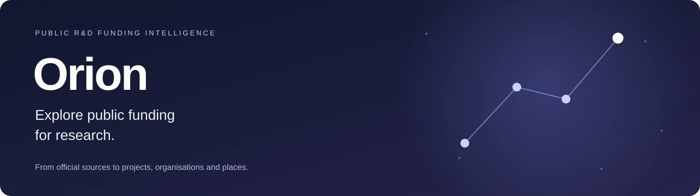
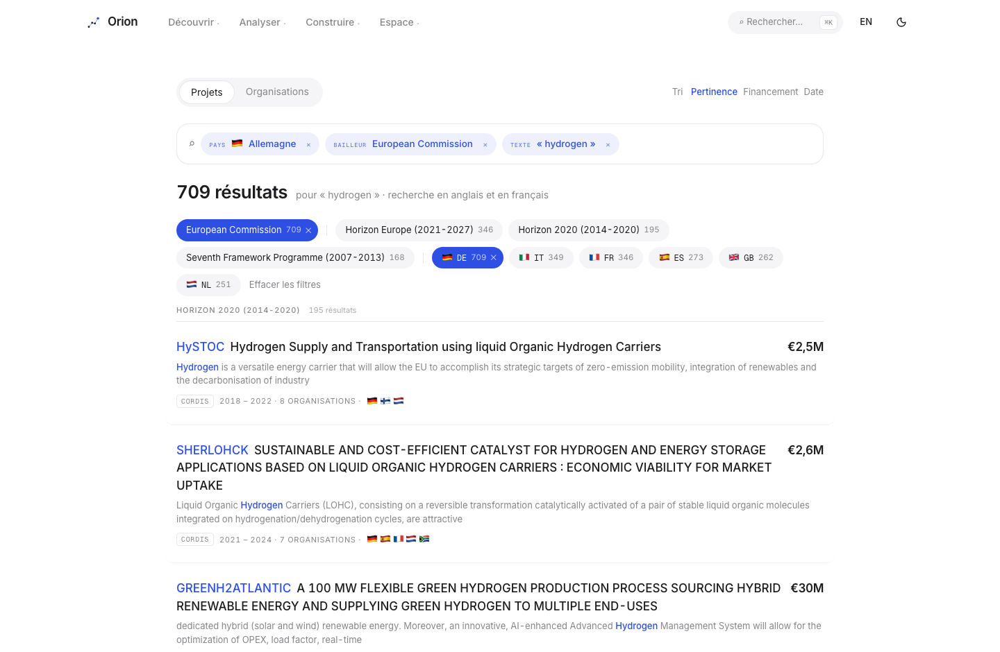

<p align="center">
  
</p>

<p align="center">
  <a href="https://lensorion.com"><strong>Visit the website</strong></a> ·
  <a href="docs/getting-started.md">Get started locally</a> ·
  <a href="docs/README.md">Documentation</a> ·
  <a href="CHANGELOG.md">Changelog</a>
</p>

<p align="center">
  <a href="https://github.com/charlotte-crocicchia/orion/actions/workflows/ci.yml"></a>
  
  
  
</p>

## What is Orion?

**Who funds research, which projects receive support, and which organisations take part?** Orion brings together public R&D funding data to make these questions explorable, from funding programmes down to individual projects and their beneficiaries.

The project combines a data pipeline, an API and an exploration interface available in English and French. It covers European **CORDIS** programmes, US **NIH RePORTER** and **NSF** funding, and calls from the European **Funding & Tenders** portal.

> **Public repository, invitation-only application.** This repository showcases the project and explains how it works. The [lensorion.com](https://lensorion.com) landing page is public; analysis tools require an approved account. The software remains **proprietary, all rights reserved**.

## What you can explore

| Your question | What Orion provides |
|---|---|
| Which projects work on a topic? | Search across titles and abstracts, with filters for countries, programmes and funders. |
| Who participates in these projects? | Organisation profiles, identity resolution and corporate groups. |
| Where does funded activity take place? | Country and regional views, programmes and research themes. |
| Where does public money go? | A path from funders to programmes, projects and organisations, with explicit source limitations. |
| How should amounts be compared over time? | Current or constant euros and context indicators such as GDP, population and purchasing power parity, where data allows. |
| Which opportunities should I follow? | Funding calls and deadlines, with dossiers in a personal workspace. |
| How can I explore an industry? | Curated thematic lenses, including space and aviation, built from versioned rules. |

### A look inside



*Development screenshot showing the French interface and its search filters. The application also supports English. Figures and appearance are illustrative, not a current snapshot of the hosted service.*

## Numbers you can explain

Orion distinguishes source data, transformations and analytical results. Missing data is not zero, and an observed funding amount is not necessarily annual expenditure. European commitments and US obligations are not interchangeable.

- **Traceability:** sources, curation rules and migrations are documented.
- **Explicit coverage:** results describe the datasets loaded, not all research worldwide.
- **Careful comparisons:** currency, period, accounting basis and available data matter.

See the [source register](docs/data-sources.md) for data attributions and terms, and the [architecture guide](docs/architecture.md) for the calculation principles. Detailed historical design documents are primarily in French; the visitor and developer guides are in English.

## Start here

| You want to… | Read or visit |
|---|---|
| Discover the project | This page, then [the website](https://lensorion.com). |
| Run Orion on your machine | [Installation and first sign-in](docs/getting-started.md). |
| Understand how it is built | [Architecture and code map](docs/architecture.md). |
| Find a method or design decision | [Documentation index](docs/README.md). |
| Report an issue or suggest an improvement | [Contribution guide](CONTRIBUTING.md), then [open an issue](https://github.com/charlotte-crocicchia/orion/issues/new/choose). |

## Quick start

Prerequisites: **Git**, **Docker with Compose**, **uv**, **Node.js 24** and **pnpm 11** (the Node/pnpm versions used in CI).

```bash
git clone https://github.com/charlotte-crocicchia/orion.git
cd orion
make bootstrap
make migrate
./scripts/claude-dev.sh
```

Open **http://localhost:5173/login**, enter `dev@lensorion.test`, and follow the development link displayed after submitting the form. No email is sent in this mode.

**The local database starts empty.** The production corpus is not bundled with the code. The [getting-started guide](docs/getting-started.md) explains data loading, configuration and troubleshooting. Development commands stop the local production Docker stack if it is already running.

## Inside the repository

```text
orion/
├── backend/          FastAPI application, ingestion, models and Python tests
│   ├── src/orion/    Business logic, search and authentication
│   ├── alembic/      Database migration history
│   └── curation/     Versioned reference data and curation rules
├── frontend/         React, TypeScript and Tailwind CSS interface
│   ├── src/          Pages, components, translations and unit tests
│   └── e2e/          End-to-end user journeys with Playwright
├── infra/            Docker, Caddy and deployment procedures
├── scripts/          Development and acceptance tools
└── docs/             Architecture, methods and design decisions
```

**Stack:** Python · FastAPI · SQLAlchemy · PostgreSQL/pgvector · React · TypeScript · Vite · Tailwind CSS · Docker · Caddy.

## Quality checks

```bash
make lint               # Python and frontend checks
make test               # pytest and Vitest; starts the development database
./scripts/e2e-local.sh   # Playwright against a dedicated test database
```

[GitHub Actions CI](https://github.com/charlotte-crocicchia/orion/actions/workflows/ci.yml) runs lint, tests, the frontend build, end-to-end journeys and latency budgets against a small dataset. Docker images are built after those checks. Service deployment is manual: see the [operations runbook](infra/README.md).

## Rights and personal data

**Proprietary — all rights reserved.** Publishing this repository does not change the software's usage rights. Source datasets have their own terms and attribution requirements, documented in the [source register](docs/data-sources.md).

Approved-account lists and configuration secrets must stay outside the repository. Use only public or fictitious data in issues and screenshots; see [CONTRIBUTING.md](CONTRIBUTING.md).
