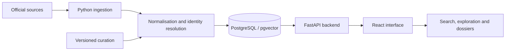

# Understanding the architecture

[Repository home](../README.md) · [Documentation](README.md) · [Local setup](getting-started.md)

Orion connects three layers: heterogeneous public sources, a queryable data model and an interface for exploring the results.

## The data pipeline

| Layer | Responsibility | Code entry point |
|---|---|---|
| Acquisition | Loaders for CORDIS, NIH, NSF, European calls and reference datasets. | [`backend/src/orion/ingest/`](../backend/src/orion/ingest/) |
| Orchestration | Loader selection, execution order and command-line entry point. | [`ingest/cli.py`](../backend/src/orion/ingest/cli.py) |
| Identity and curation | Organisation resolution, groups and thematic lenses. | [`backend/curation/`](../backend/curation/) and the `dedup`, `gleif`, `wikidata`, `groups`, `lenses` loaders. |
| Persistence | Relational models and schema evolution. | [`models/`](../backend/src/orion/models/) and [`alembic/`](../backend/alembic/) |
| Search and API | Search, filters, aggregations and domain endpoints. | [`search/`](../backend/src/orion/search/) and [`api/`](../backend/src/orion/api/) |
| Interface | Pages, components, query state and English/French translations. | [`frontend/src/`](../frontend/src/) |

Funding data primarily comes from **CORDIS**, **NIH RePORTER** and **NSF**. **GLEIF** and **Wikidata** contribute to the identity layer. Other series provide exchange rates, price indices and macroeconomic indicators. The [source register](data-sources.md) documents coverage and attribution.

## Calculation principles

- **Currency and purchasing power:** currency conversion does not replace inflation adjustment. The [Reference Engine](conception-reference-engine.md) documents available measures and their requirements.
- **Accounting basis:** commitments, annual obligations and cumulative amounts are not interchangeable. The [money trail](conception-b-chaine-argent-public.md) explains breakdowns and reconciliation gaps.
- **Identity:** a legal entity and its corporate group are different units. Matching and consolidation rules are described in the [group identity layer](groupes-couche.md).
- **Coverage:** results describe known data only. Missing values must remain distinct from zero.

The detailed design references above are in French and may include proposed or deferred work. Check the [changelog](../CHANGELOG.md), routes and tests to determine what is implemented.

## Navigation and access

The [frontend router](../frontend/src/app.tsx) is the entry point for finding pages: project and organisation search, the explorer, comparisons, calls, the money trail and workspaces.

Access uses **magic links**, an approved-account list and sessions. The landing page and sign-in routes are public; application features are protected. Authentication logic lives in [`auth/`](../backend/src/orion/auth/), routes in [`api/auth.py`](../backend/src/orion/api/auth.py), and settings in [`core/config.py`](../backend/src/orion/core/config.py).

## Testing and operations

- [`backend/tests/`](../backend/tests/): API, business logic and data behaviour.
- [`frontend/src/`](../frontend/src/): component and function unit tests.
- [`frontend/e2e/`](../frontend/e2e/): Playwright user journeys.
- [CI workflow](../.github/workflows/ci.yml): lint, tests, builds, latency budgets and Docker images.
- [`infra/`](../infra/README.md): Docker stack, Caddy, backups, refresh jobs and manual deployment.

See the [ADRs](adr/) for initial decisions, or return to the [documentation index](README.md) to browse design records.
