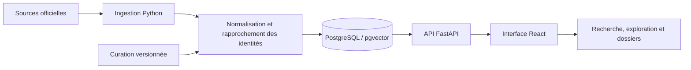

# Comprendre l’architecture

[Accueil du dépôt](../README.md) · [Documentation](README.md) · [Démarrage local](getting-started.md)

Orion relie trois ensembles : des sources publiques hétérogènes, un modèle de données exploitable et une interface pour interroger ces données.

## La chaîne de données

| Couche | Responsabilité | Où lire le code |
|---|---|---|
| Acquisition | Chargeurs CORDIS, NIH, NSF, appels européens et référentiels. | [`backend/src/orion/ingest/`](../backend/src/orion/ingest/) |
| Orchestration | Choix et ordre des chargeurs, exécution en ligne de commande. | [`ingest/cli.py`](../backend/src/orion/ingest/cli.py) |
| Identités et curation | Rapprochement des organisations, groupes et lentilles thématiques. | [`backend/curation/`](../backend/curation/) et les chargeurs `dedup`, `gleif`, `wikidata`, `groups`, `lenses`. |
| Persistance | Modèles relationnels et évolution du schéma. | [`models/`](../backend/src/orion/models/) et [`alembic/`](../backend/alembic/) |
| Recherche et API | Recherche, filtres, agrégations et endpoints métier. | [`search/`](../backend/src/orion/search/) et [`api/`](../backend/src/orion/api/) |
| Interface | Pages, composants, état des requêtes et traductions FR/EN. | [`frontend/src/`](../frontend/src/) |

Les données de financement proviennent principalement de **CORDIS**, **NIH RePORTER** et **NSF**. **GLEIF** et **Wikidata** contribuent à la couche d’identité. D’autres séries apportent les taux de change, prix et indicateurs macroéconomiques. Le [registre des sources](data-sources.md) détaille les périmètres et attributions.

## Les principes de calcul

- **Devise et pouvoir d’achat** : la conversion monétaire ne remplace pas la correction de l’inflation. Le [Reference Engine](conception-reference-engine.md) documente les lectures disponibles et leurs conditions.
- **Nature des montants** : engagements, obligations annuelles et cumuls ne sont pas des mesures interchangeables. La [chaîne de l’argent](conception-b-chaine-argent-public.md) explicite les décompositions et leurs écarts.
- **Identités** : une entité légale et son groupe ne sont pas la même unité. Les rapprochements et règles de consolidation sont documentés dans la [couche groupes](groupes-couche.md).
- **Couverture** : les résultats ne décrivent que les données connues. Une valeur absente doit rester distincte de zéro.

Les documents de conception peuvent aussi contenir des étapes proposées ou reportées. Pour savoir ce qui est effectivement implémenté, confrontez-les au [changelog](../CHANGELOG.md), aux routes et aux tests.

## Navigation et accès

Le [routeur frontend](../frontend/src/app.tsx) est le point de départ pour retrouver les pages : recherche de projets et d’organisations, explorateur, comparaisons, appels, chaîne de l’argent et espaces de travail.

L’accès au service repose sur des **liens magiques**, une liste de comptes autorisés et des sessions. La page d’accueil et les routes de connexion sont publiques ; les surfaces métier sont protégées. La logique est dans [`auth/`](../backend/src/orion/auth/), les routes dans [`api/auth.py`](../backend/src/orion/api/auth.py) et les paramètres dans [`core/config.py`](../backend/src/orion/core/config.py).

## Tests et exploitation

- [`backend/tests/`](../backend/tests/) : API, logique métier et comportements des données.
- [`frontend/src/`](../frontend/src/) : tests unitaires de composants et fonctions.
- [`frontend/e2e/`](../frontend/e2e/) : parcours utilisateur avec Playwright.
- [Workflow CI](../.github/workflows/ci.yml) : lint, tests, build, budgets de latence et images Docker.
- [`infra/`](../infra/README.md) : pile Docker, Caddy, sauvegardes, rafraîchissement et déploiement manuel.

Pour les décisions initiales, voir les [ADR](adr/). Pour naviguer parmi les documents de travail, revenir à l’[index](README.md).
