# État des lieux du produit — tout ce qu'Orion sait faire, écran par écran

> **PÉRIMÉ depuis le 2026-08-22 — lire avec précaution.** Ce relevé
> précède : le pivot accès privé (la prod est `https://lensorion.com`,
> porte close hors allowlist — plus `localhost:8080`), les surfaces
> `/money` (chaîne de l'argent, B2), `/nsf-obligations` (R5B), `/login`,
> et la mise en fonction de `/calls` et `/workspace` (le § 1.11
> « portes datées, sans fonction » est FAUX aujourd'hui : les deux
> routes sont fonctionnelles). Une refonte écran par écran est un
> chantier à part (audit Hygiène, B6). *(Bandeau posé le 2026-08-29.)*

Chantier documentation, 2026-08-21. Constat **sur pièce** : chaque page de
ce document a été ouverte dans la prod locale (`make up`, `http://localhost:8080`,
version affichée au pied de page **v0.4.0**), chaque menu déroulé, chaque
état cliqué. Le code n'a servi qu'à vérifier l'exhaustivité (table des
routes, liste des composants) ; l'écran fait foi. Les compteurs animés
sont lus à leur valeur haute. Les captures (dossier
[`captures/etat-des-lieux/`](captures/etat-des-lieux/)) ont été produites
au format du harnais officiel (1440 × 900, Chromium), interface en
français, thème sombre — les deux se changent d'un clic, voir § 8.

Ce document est une **photographie, pas un audit** : il décrit ce qui
est, sans évaluation ni recommandation. Il est écrit pour des regards
extérieurs qui n'ont jamais vu Orion.

## Ce qu'est Orion, en quatre définitions

**Orion** est une application web qui cartographie les financements
publics de R&D à partir de sources officielles (Union européenne :
CORDIS ; États-Unis : NIH et NSF). Son pied de page résume le corpus :
**699 798 projets · 110 116 organisations · €734B de financements
publics cartographiés**, période 2005–2027.

**Une lentille** (*lens*) est une lecture sectorielle du même corpus :
un jeu de règles versionné qui marque, projet par projet, ce qui relève
d'un secteur. Deux lentilles sont publiées : **Espace** et
**Aéronautique**. Une lentille n'est jamais une partition : un projet
peut être lu par plusieurs lentilles, et les chiffres de deux lentilles
ne s'additionnent pas (l'écran le dit, voir « À propos des données »).

**Un périmètre** est la portée d'une lentille : « direct » (le cœur du
secteur seul) ou « + habilitant » (le cœur plus les technologies qui le
servent). L'URL le porte (`?sector=space`, `?sector=space-direct`,
`?sector=aviation`, `?sector=aviation-direct`) et l'écran l'affiche
toujours en toutes lettres.

**Le dossier** est le panier de l'utilisateur : des vues du produit
collectées, réordonnées, annotées, puis emportées (impression). Il vit
dans le navigateur (localStorage), sans compte.

## Table des matières

1. [L'inventaire des pages](#1-linventaire-des-pages)
2. [La navigation](#2-la-navigation)
3. [Les visualisations, exhaustivement](#3-les-visualisations-exhaustivement)
4. [Les données affichées](#4-les-données-affichées)
5. [Le dossier](#5-le-dossier)
6. [Les capacités annoncées non actives](#6-les-capacités-annoncées-non-actives)
7. [La recherche et les filtres](#7-la-recherche-et-les-filtres)
8. [Les registres transverses](#8-les-registres-transverses)

---

## 1. L'inventaire des pages

Dix-huit routes existent (17 déclarées + la page 404). Aucune page
« changelog » n'est servie par le produit (le dépôt en tient un, hors
site). Toutes les pages sauf la Lens Room partagent le même gabarit :
header, contenu, footer.

| Route | Nom | Rôle |
|---|---|---|
| `/lenses` | La Lens Room | choisir sa lentille d'entrée |
| `/` | Accueil | héros chiffré, recherche, portes d'intention, globe, actualités |
| `/projects` | Recherche de projets | recherche + facettes, liste groupée |
| `/projects/:id` | Fiche projet | un projet financé, en entier |
| `/organisations` | Classement des organisations | recherche + classement |
| `/organisations/:id` | Fiche organisation | trajectoire, collaborateurs, veille, portefeuille |
| `/groups/:id` | Fiche groupe | un groupe industriel consolidé |
| `/compare` | Comparateur | jusqu'à 4 organisations ou groupes côte à côte |
| `/dossier` | Le dossier | les vues collectées |
| `/analyses` | Analyses prêtes | bibliothèque de 14 analyses |
| `/calls` | Appels (porte P5) | vitrine datée, sans fonction |
| `/workspace` | Espace de travail (porte P6) | vitrine datée, sans fonction |
| `/explore` | L'Explorateur | composer métrique × dimension × comparaison |
| `/explore/countries` | Pays & monde | globe/carte + classement des 208 pays |
| `/explore/regions/:slug` | Fiche région | une des 5 régions du monde |
| `/explore/countries/:code` | Fiche pays | un pays, ses régions, ses acteurs |
| `/explore/programmes` | Programmes | une rangée par agence, dépliable |
| `/explore/programmes/:id` | Fiche programme | un programme-cadre ou institut |
| `/explore/themes` | Thèmes | les 41 disciplines euroSciVoc |
| `/about-data` | À propos des données | sources, licences, méthodologies |
| `*` | 404 | « Page introuvable », retour à la recherche |

### 1.1 La Lens Room — `/lenses`

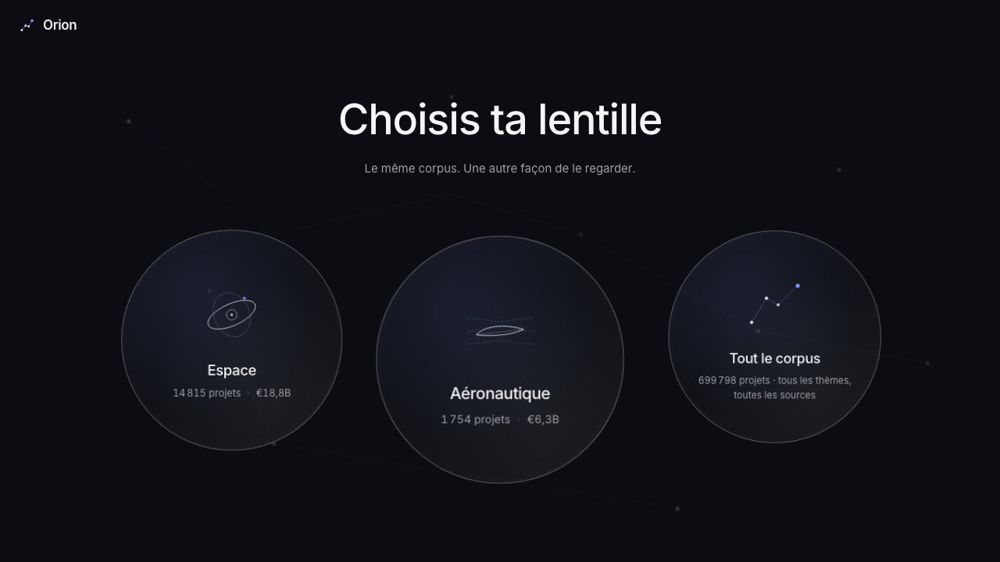

Page d'entrée, hors gabarit : fond noir constellé, header réduit au seul
logo « Orion » (qui ramène à l'accueil). Titre « Choisis ta lentille »
(le produit tutoie ici ; en anglais « Choose your lens »), sous-titre
« Le même corpus. Une autre façon de le regarder. » Trois verres
circulaires, chacun orné d'un glyphe animé (orbite pour l'Espace,
silhouette d'aile pour l'Aéronautique, constellation pour le corpus) :

- **Espace** — « 14 815 projets · €18,8B » ;
- **Aéronautique** — « 1 754 projets · €6,3B » ;
- **Tout le corpus** — « 699 798 projets · chaque thème, chaque source ».

Cliquer un verre enregistre le choix (`orion.lens.entry` en
localStorage) et ouvre l'accueil — cadré (`/?sector=space` ou
`/?sector=aviation`) ou général (`/`).

**Comment on y entre.** Un premier visiteur qui demande `/` est redirigé
vers `/lenses` tant qu'aucun verre n'a été choisi ; les URL profondes
(`/projects`, une fiche…) ne redirigent pas. Ensuite : le chip de
périmètre du header (« /SPACE ») pointe vers `/lenses`, ainsi que le
lien « Les lentilles → » du héros et l'entrée « The lenses → » du menu
du chip de périmètre.

### 1.2 L'accueil — `/`

**Le héros défilant.** Le premier écran affiche un grand montant, une
phrase (« de financements R&D publics, cartographiés. 2000 → 2027. »),
la ligne des sources, trois compteurs (projets financés, organisations,
pays participants), une frise chronologique 2000 → 2027 qui se dessine
en bas d'écran, et l'indication « DÉFILER ↓ ». Le défilement pilote le
tout : les années avancent, les compteurs montent. À l'ouverture
l'écran affiche €88B / 83 976 projets / 13 214 organisations / 25 pays ;
en fin de course : **€734B / 699 798 projets financés / 110 116
organisations / 208 pays participants**.

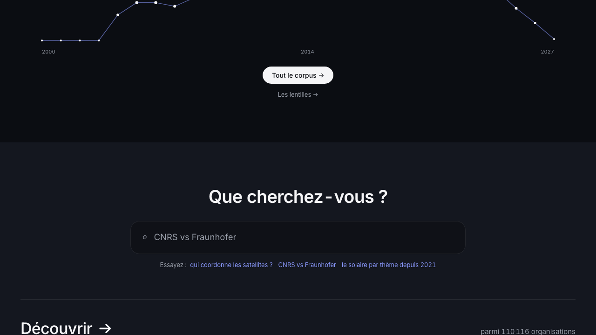

Deux liens sous le héros : « Tout le corpus → »
(`/explore?by=country&split=0`) et « Les lentilles → » (`/lenses`).

**La recherche et les portes d'intention.**

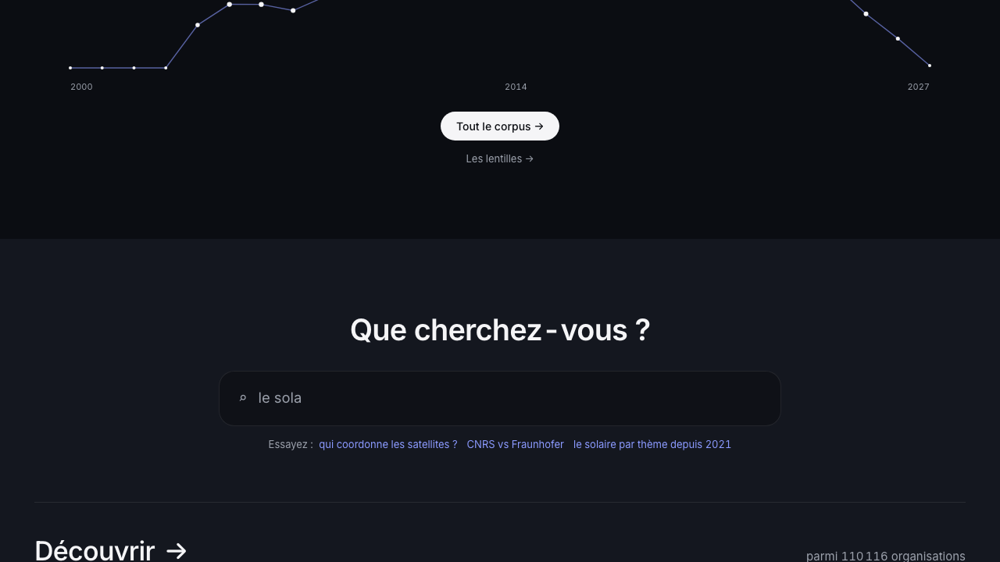

Sous le héros : « Que cherchez-vous ? », un champ de recherche
composable (placeholder « l'observation de la Terre par pays depuis
2020… ») avec trois puces d'exemple (« qui coordonne les satellites ? »,
« CNRS vs Fraunhofer », « le solaire par thème depuis 2021 » — voir
§ 7). Puis quatre portes, chacune une grande rangée :

- **Découvrir →** « parmi 110 116 organisations » + un exemple vivant
  (la fiche du moment, p. ex. Johns Hopkins) — lien vers cette fiche ;
- **Analyser →** « 14 analyses prêtes » + un exemple (« Où va l'argent
  de l'hydrogène ? — 5 angles, glissés ») — lien vers l'analyse ;
- **Construire →** « collectionnez des vues, assemblez, emportez —
  depuis n'importe quel graphique » — lien vers `/dossier` (quand le
  dossier contient des vues, la porte affiche leur compte : « votre
  dossier de session : n vues — reprenez-le ») ;
- **Suivre** — porte **non cliquable**, badge `P5–P6 · 2026–2027` :
  « alertes et suivis — les appels à l'automne 2026, l'espace de
  travail en 2027 ».

**Le monde des financements.**

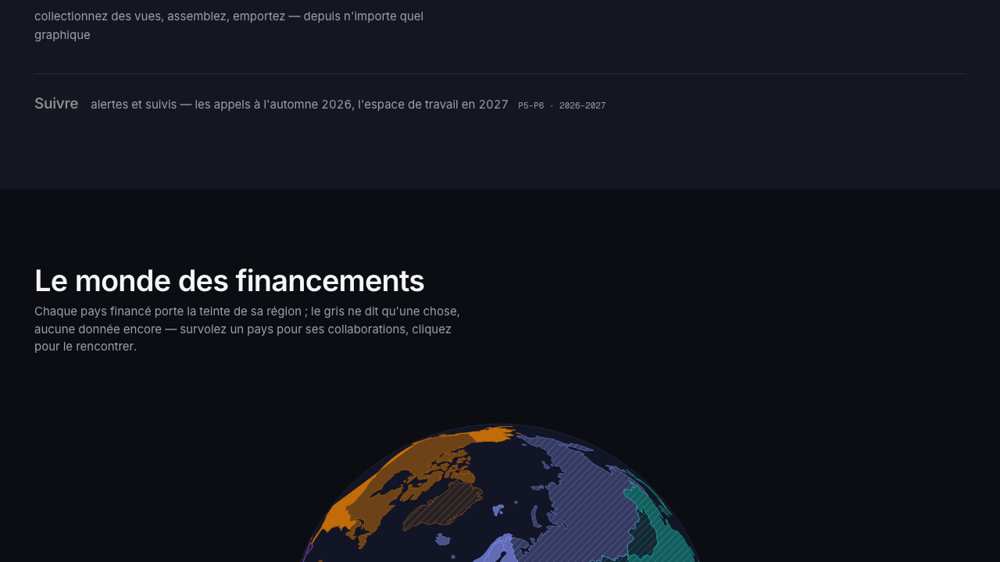

Un globe 3D interactif (voir § 3.6) avec sa légende (5 régions
colorées, « pas encore de donnée », « financements domestiques non
couverts »), la consigne « glisser pour tourner · cliquer un pays
couvert », et la ligne de couverture : « Couverture : Europe — CORDIS
(Horizon Europe, H2020, FP7) · États-Unis — NIH, NSF. Ensuite :
Royaume-Uni (UKRI), Suisse (SNSF), Pays-Bas (NWO), Suède (Vinnova). »

**Les actualités.**

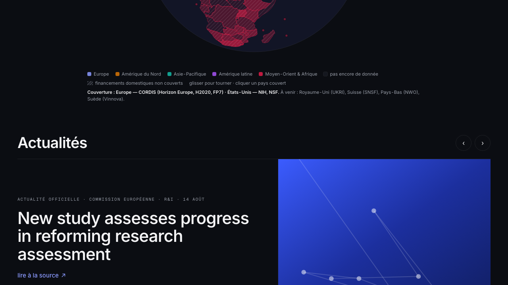

Un carrousel de 7 cartes (boutons ‹ ›, points de position, avance
automatique) qui alterne deux natures de cartes :

- des **récits du corpus**, calculés sur les données et menant à la vue
  qui les prouve : « LE DUEL · ORGANISATIONS » (deux organisations au
  coude-à-coude → le comparateur), « LA PERCÉE · VEILLE » (une entrée
  dans le top 10 → sa fiche), « LA GROSSE SIGNATURE · PROJETS » (le
  plus gros projet signé → sa fiche), « LE MOUVEMENT · THÈMES » (une
  discipline qui accélère, p. ex. « +535 % » → la course des thèmes) ;
- des **actualités officielles** (« OFFICIAL NEWS · COMMISSION
  EUROPÉENNE · R&I », datées) ornées d'une constellation décorative —
  « lire à la source ↗ » ouvre le site officiel.

**Le pied de page.**

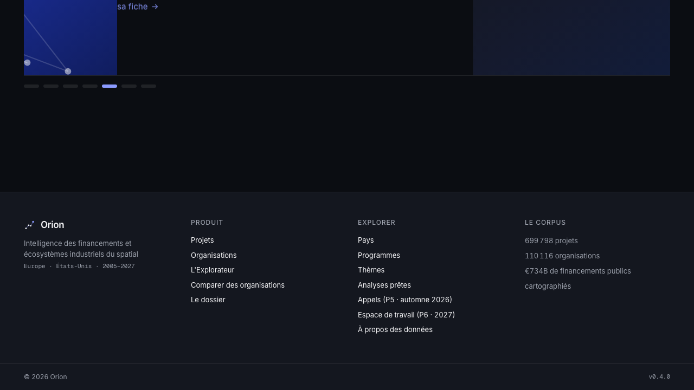

Quatre blocs : la marque (« Orion — Space funding & industrial
intelligence — Europe · United States · 2005–2027 » ; en français :
« Intelligence des financements et écosystèmes industriels du
spatial ») ; la colonne
PRODUIT (Projets, Organisations, l'Explorateur, Comparer les
organisations, Le dossier) ; la colonne EXPLORER (Pays, Programmes,
Thèmes, Analyses prêtes, Appels (P5 · automne 2026), Espace de travail
(P6 · 2027), À propos des données) ; le bloc LE CORPUS (699 798 projets,
110 116 organisations, €734B). Dernière ligne : « © 2026 Orion ·
v0.4.0 ».

**L'accueil cadré par une lentille** (`/?sector=space`,
`/?sector=aviation`) :

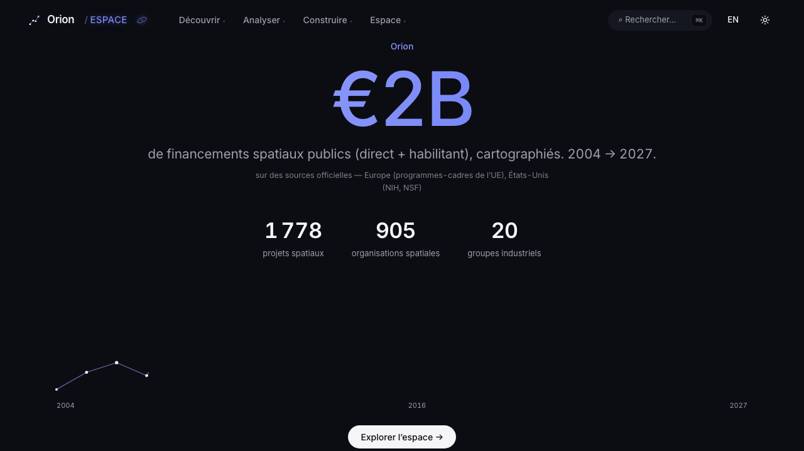

- le héros devient sectoriel : « de financements publics **spatiaux**
  (direct + habilitant), cartographiés. 2004 → 2027 », compteurs
  « projets spatiaux / organisations spatiales / groupes industriels »
  (en fin de course, Espace : €19B affiché · 14 815 projets · 7 540
  organisations · 170 groupes ; Aéronautique : 1 754 projets · 2 926
  organisations · 143 groupes, 2007 → 2026) ; le bouton principal
  devient « Explorer l'espace → » / « Explorer l'aéronautique → » ;
- une section « LE CORPUS ENTIER » s'insère : « Adossé à un corpus de
  699 798 projets… la profondeur généraliste qui repère les
  technologies venues d'autres secteurs. Tout le corpus → » ;
- la porte Analyser prend l'exemple de la lentille (« Où va l'argent
  spatial ? — 4 angles ») ;
- globe, actualités et footer restent ceux du corpus.

### 1.3 Recherche de projets — `/projects`

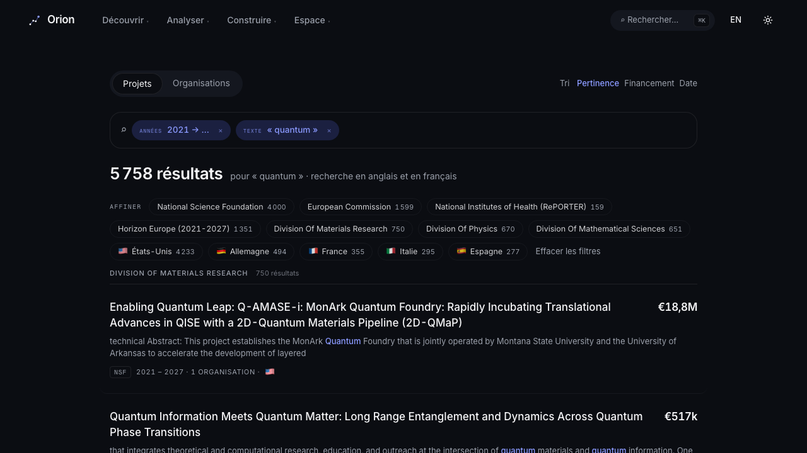

Page recherche-d'abord : onglets **Projets / Organisations**, tri
(**Pertinence / Financements / Date**), champ de recherche, puces
d'exemple (« 🇩🇪 Germany + European Commission + hydrogen », « quantum
since 2021 », « 🇺🇸 United States + health »). Vide, la page affiche
« La question d'abord — composez-la ci-dessus, la liste suit » et les
sorties « EXPLORER D'ICI » (Pays, Programmes, Organisations).

Une recherche affiche : les critères actifs en **puces retirables**
(ANNÉES « 2021 → … » ×, TEXTE « quantum » ×), le compte de résultats
(« 5 758 résultats pour “quantum” · cherché en anglais et en
français »), un panneau **AFFINER** (financeurs et programmes avec leurs
comptes, pays avec drapeaux et comptes, « Effacer les filtres »), puis
les résultats **groupés par programme**, chaque groupe titré avec son
compte. Une carte résultat : acronyme + titre, montant, badge source
(CORDIS…), extrait d'abrégé le cas échéant, années, nombre
d'organisations, drapeaux des pays.

Quand la requête correspond à un groupe industriel, une **carte
GROUPE** apparaît en tête (règle d'écran : jamais enterrée sous les
homonymes) : badge GROUPE, drapeau, nom, « n entités juridiques »,
montant consolidé — lien vers la fiche groupe.

### 1.4 Fiche projet — `/projects/:id`

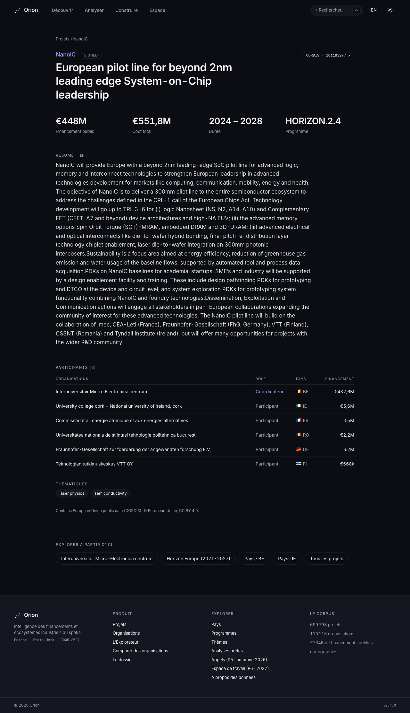

Exemple constaté : NanoIC. Fil d'Ariane « Projets › NanoIC », statut
(`SIGNED`), source + identifiant externe cliquable (« CORDIS ·
101183277 ↗ » vers cordis.europa.eu), titre complet, quatre grandeurs
(**€448M financement public · €551,8M coût total · 2024 – 2028 durée ·
HORIZON.2.4 programme**), abrégé (étiqueté `EN` — la langue du texte
source), table des **participants** (organisation → sa fiche, rôle
Coordinator/Participant, pays, financement), **topics** (mots-clés),
ligne de licence (« Contains European Union public data (CORDIS),
© European Union, CC BY 4.0 »), sorties « EXPLORER D'ICI »
(coordinateur, programme, pays du consortium, « Tous les projets » =
recherche sur l'acronyme). Pas de bouton dossier sur cette page.

### 1.5 Classement des organisations — `/organisations`

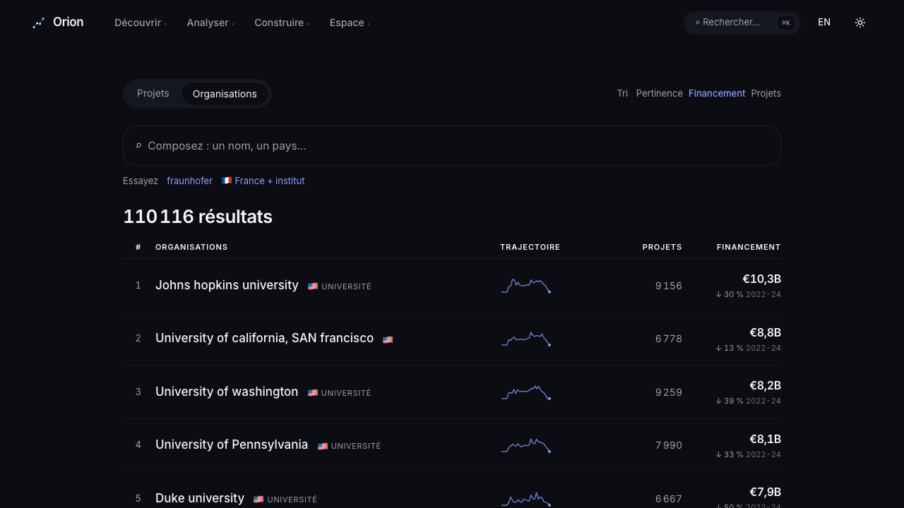

Même coquille que `/projects` (onglets, recherche — placeholder
« Composez : un nom, un pays… »), tri **Pertinence / Financement /
Projets**, puces d'exemple (« fraunhofer », « 🇫🇷 France
+ institut »). Sans requête : le classement complet (« 110 116
résultats ») en tableau — rang, nom + drapeau + type (UNIVERSITY,
COMPANY, RESEARCH ORGANISATION, PUBLIC BODY…), colonne TRAJECTOIRE
(sparkline 72 × 22 px par rangée), projets, financements, et le
**momentum** (« ↓ 30 % 2022-24 », « — » à défaut). Sous lentille, le
classement se recadre (« 7 540 résultats », chip de périmètre « Espace
+ habilitant ▾ » au-dessus du tableau).

### 1.6 Fiche organisation — `/organisations/:id`

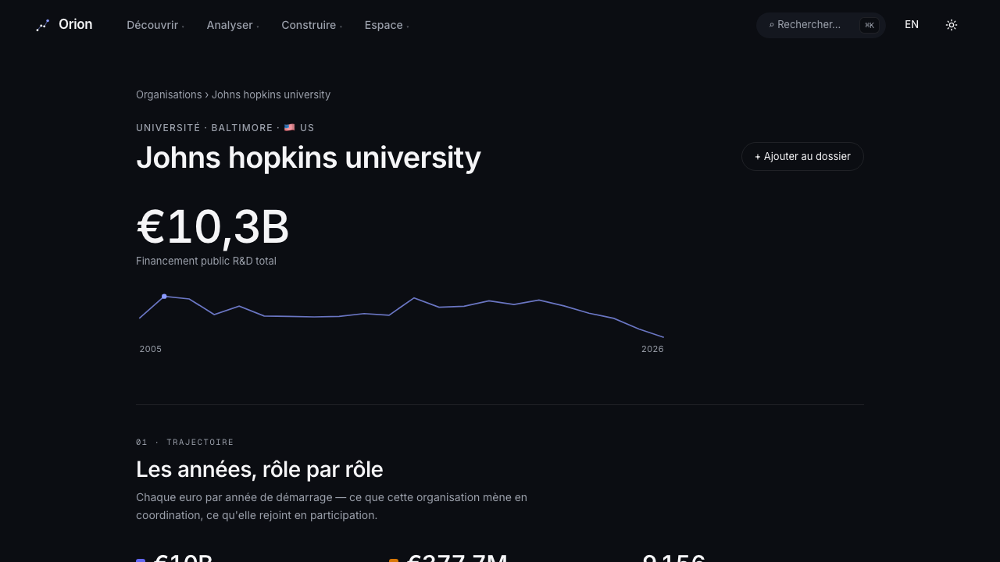

Exemple constaté : Johns Hopkins University (et CNRS, Fraunhofer). De
haut en bas :

- **En-tête** : fil d'Ariane, surtitre « TYPE · VILLE · 🇺🇸 US », nom,
  bouton **+ Ajouter au dossier**, grand total (« €10,3B — financements
  publics R&D totaux ») avec sparkline des années ;
- **01 · TRAJECTOIRE** — « Les années, rôle par rôle » : barres
  verticales par année de démarrage, empilant coordonné/participé, avec
  les agrégats (« €10B mené comme coordinateur · 96 % », « €377,7M
  rejoint comme participant · 4 % », « 9 156 projets · 1975 – 2026 »)
  et la légende Coordonné / Participé ;

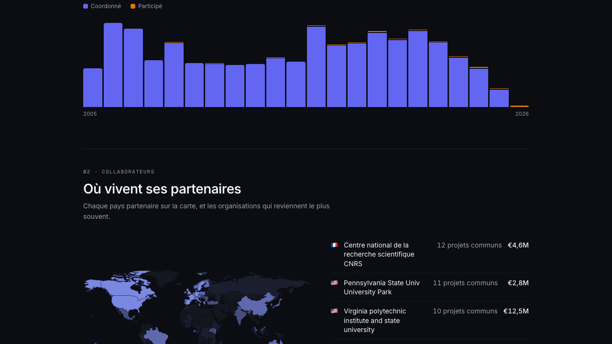

- **02 · COLLABORATEURS** — « Où vivent ses partenaires » : carte du
  monde des pays partenaires (« Premier clic : le pays se sélectionne ;
  un second ouvre sa fiche ») + la liste des organisations qui
  reviennent le plus (drapeau, nom → sa fiche, « n projets partagés »,
  montant) ;
- **PROFIL THÉMATIQUE** : les thèmes dominants avec montant et part ;
  note « Un projet portant plusieurs thèmes compte dans chacun » ;
- **SIGNAUX** (le poste de veille) : signaux à seuils — « ↑ 30 % —
  biological sciences accélère dans ce portefeuille (2022-24 vs
  2019-21) » avec lien « ouvrir la tendance du thème », « 50+ nouveaux
  partenaires sur 24 mois » avec exemples nommés ;
- **PORTEFEUILLE** : table paginée des projets (projet → sa fiche,
  rôle, année, financement ; ← Précédent / Suivant →) ;
- **TOP PROGRAMMES** : les programmes principaux avec montants ;
- **EN BREF** : projets, dont coordinateur, période active, momentum ;
- **ID** : identifiants portés, en coches (PIC ✓ UEI ✓ IPF ✓ LEI ✓) +
  site web ↗ ;
- **Comparer →** (préremplit le comparateur) et « EXPLORER D'ICI ».

Sous lentille, la fiche **porte** la lentille (ses liens la gardent)
mais ses chiffres restent ceux du corpus entier.

### 1.7 Fiche groupe — `/groups/:id`

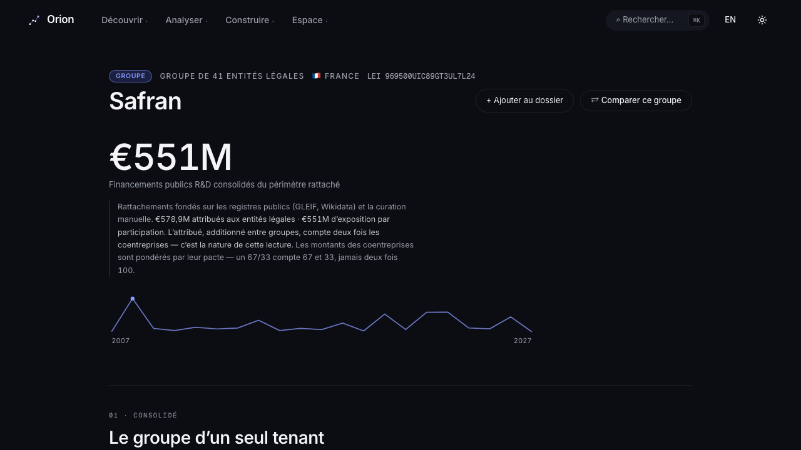

Exemple constaté : Safran. En-tête : badge GROUPE, « GROUPE DE 41
ENTITÉS JURIDIQUES », pays, LEI, nom, **+ Ajouter au dossier**, **⇄
Benchmarker ce groupe** (→ comparateur), total consolidé (« €551M —
financements publics R&D consolidés du périmètre rattaché »), et la
note de méthode à l'écran : rattachements construits de GLEIF, Wikidata
et curation manuelle ; « €578,9M attribués aux entités · €551M
d'exposition par participation » ; les coentreprises pondérées par leur
pacte (« un 67/33 compte 67 et 33, jamais deux fois 100 »).

Quatre sections numérotées :

- **01 · CONSOLIDÉ** — « Le groupe comme un seul » : 255 projets
  distincts · 41 entités · 8 pays ; « La trajectoire, entité par
  entité — top 5, le reste consolidé » (aires/courbes empilées par
  entité) ; « Ce sur quoi le groupe entier travaille » (thèmes avec
  compte de projets) ;
- **02 · ENTITÉS** — « Où vit le groupe » : carte du monde filtrable
  par région, échelle de financement, puis la liste complète des
  entités — chacune avec drapeau, nom, **provenance du rattachement et
  confiance** (« Membership: curation, confidence 95 % », « gleif,
  75 % »), badge « JOINT VENTURE · 50 % » le cas échéant, montant, part
  du groupe, projets. Note finale : « Les parts s'énoncent sur le total
  consolidé ; des entités cosignataires d'un même projet peuvent
  dépasser 100 %. » ;
- **03 · PARTENAIRES** — « Avec qui le groupe travaille » : les
  organisations cosignataires (« les cosignatures internes ne comptent
  jamais comme partenariats ») ;
- **04 · POSTE DE VEILLE** — profil thématique consolidé et signaux à
  seuils (« sous les planchers d'honnêteté, rien ne s'affiche du
  tout »). Clôture : « Alimenté par 3 sources. »

### 1.8 Comparateur — `/compare`

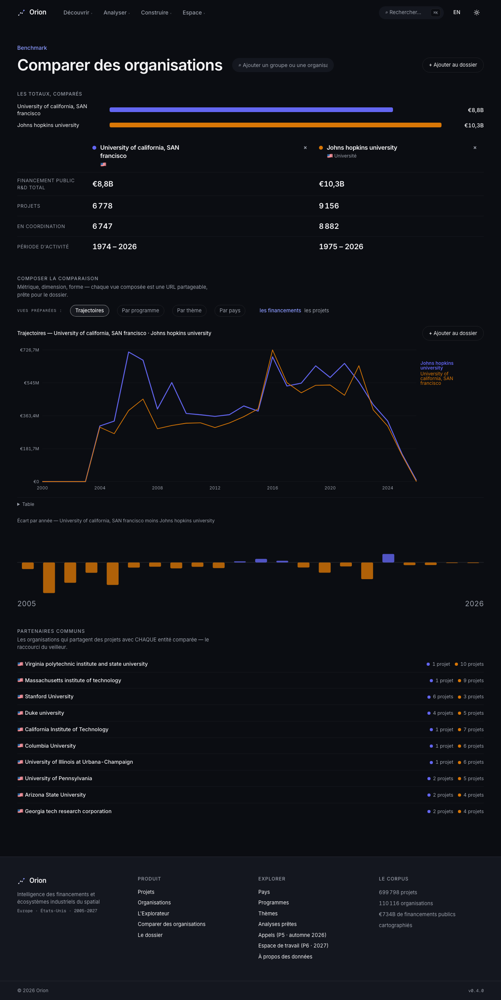

Vide : « Comparer les organisations — cherchez une organisation
ci-dessus pour lancer la comparaison — jusqu'à quatre côte à côte. » Le
champ accepte « un groupe ou une organisation ». Garni
(`?orgs=128285~12267`) :

- **TOTAUX, COMPARÉS** : les grands montants côte à côte ;
- colonnes retirables (×) ; table de synthèse : financements totaux,
  projets, dont coordinateur, période active ;
- **COMPOSER LA COMPARAISON** — « Métrique, dimension, forme — chaque
  vue composée est une URL partageable, prête pour le dossier » : vues
  préparées **Trajectoires / Par programme / Par thème / Par pays**,
  métrique **financements / projets**, bouton **+ Ajouter au dossier**
  par vue et bascule Table ;
- **Écart annuel** (« X moins Y ») : barres divergentes par année ;
- **PARTENAIRES COMMUNS** : « les organisations qui partagent des
  projets avec CHAQUE entité comparée — le raccourci du veilleur »,
  avec le compte de projets côté chaque comparé.

Le comparateur est une surface **sans lentille** : les liens du produit
n'y portent pas `?sector=`.

### 1.9 Le dossier — `/dossier` — voir § 5

### 1.10 Analyses prêtes — `/analyses`

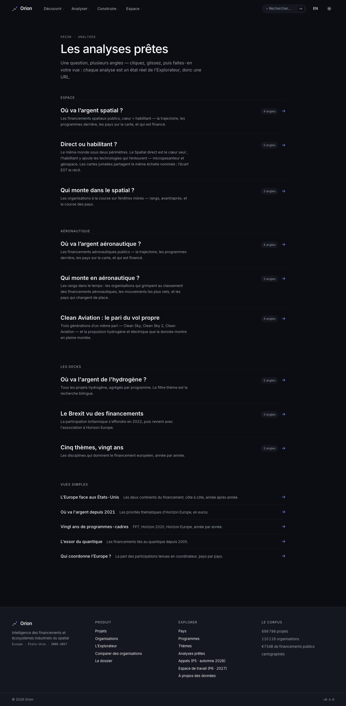

« Une question, plusieurs angles — cliquez, glissez, puis faites-en
votre vue : chaque analyse est un état réel de l'Explorateur, donc une
URL. » **14 analyses** en quatre groupes :

- **ESPACE** : « Où va l'argent spatial ? » (4 angles), « Direct ou
  habilitant ? » (5 angles — cartes jumelles sous même échelle nommée :
  « l'écart EST l'histoire »), « Qui monte dans l'espace ? » (3) ;
- **AVIATION** : « Où va l'argent de l'aéronautique ? » (4), « Qui
  monte en aéronautique ? » (3), « Clean Aviation : le pari du vol
  propre » (4) ;
- **LES DECKS** : « Où va l'argent de l'hydrogène ? » (5), « Le Brexit,
  vu des financements » (3), « Cinq thèmes, vingt ans » (3) ;
- **VUES SIMPLES** (5, un seul angle) : « Europe vs États-Unis », « Où
  va l'argent depuis 2021 », « Vingt ans de programmes-cadres », « La
  montée du quantique », « Qui coordonne l'Europe ? ».

Sous lentille, la bibliothèque se filtre sur la section de la lentille
et ajoute « Voir toutes les analyses → ».

### 1.11 Les portes datées — `/calls` et `/workspace`

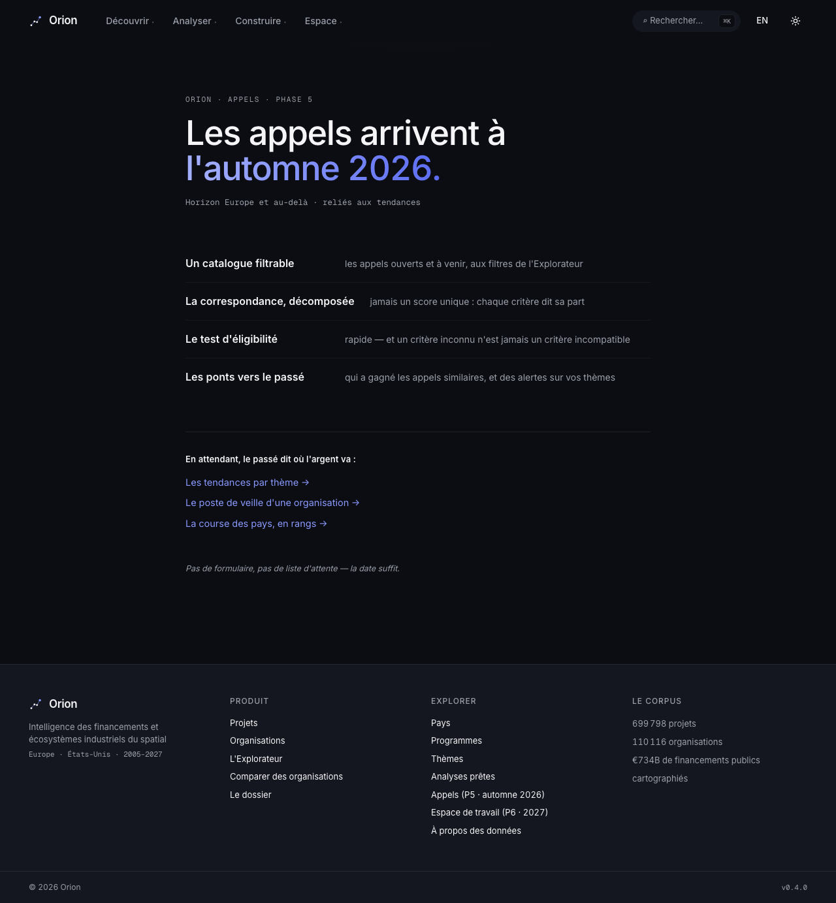
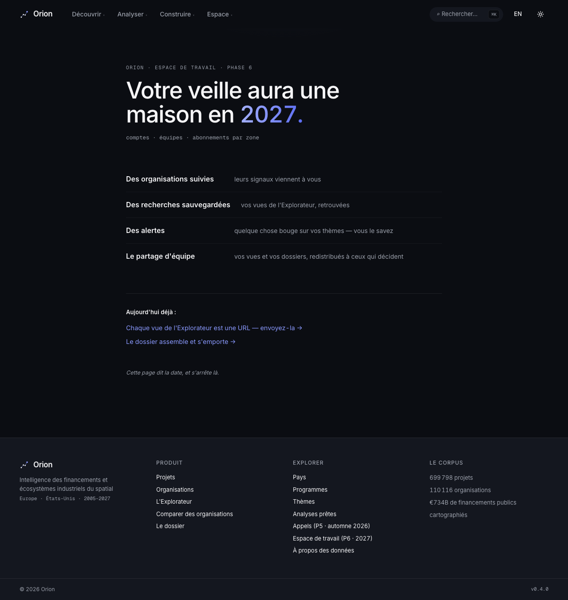

Deux vitrines sans fonction, du même gabarit (voir § 6) : surtitre
(« ORION · APPELS · PHASE 5 » / « ORION · ESPACE DE TRAVAIL ·
PHASE 6 »), promesse datée en titre, quatre features décrites, des
ponts vers l'existant, et une clôture explicite (« Pas de formulaire,
pas de liste d'attente — la date suffit. » / « Cette page dit la date,
et s'arrête là. »).

### 1.12 L'Explorateur — `/explore` — voir § 3.1–3.5 et § 7

### 1.13 Pays & monde — `/explore/countries`

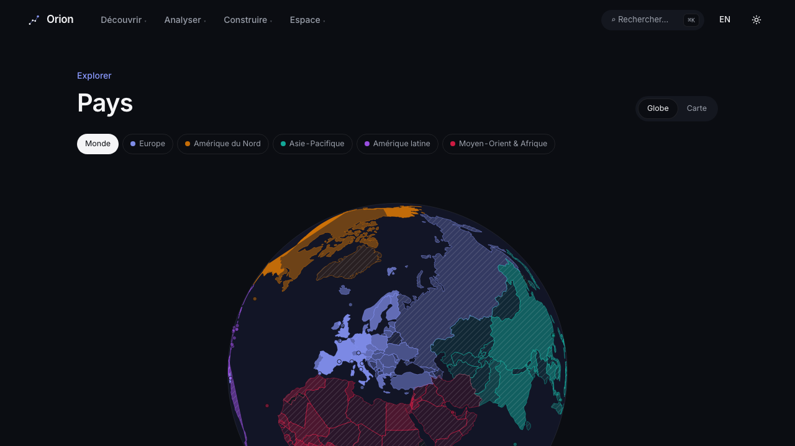
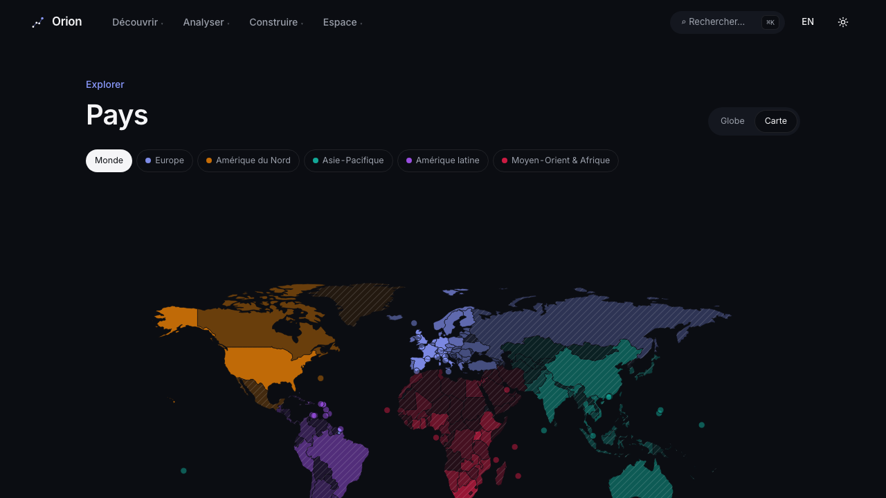

Bascule **Globe / Carte** (choix retenu en localStorage, pas dans
l'URL), onglets de région (Monde, Europe, Amérique du Nord,
Asie-Pacifique, Amérique latine, Moyen-Orient & Afrique — chaque nom de
région lie vers sa fiche), légende et couverture, puis le **classement
des 208 pays** : rang, drapeau, nom, badge « MEMBRE DE L'UE », montant,
projets — chaque rangée ouvre la fiche pays. Sur la carte comme sur le
globe : survol = les collaborations du pays ; « Premier clic : le pays
se sélectionne · un second ouvre sa fiche » (le clic ouvre le **panneau
pays**, § 3.7).

### 1.14 Fiche région — `/explore/regions/:slug`

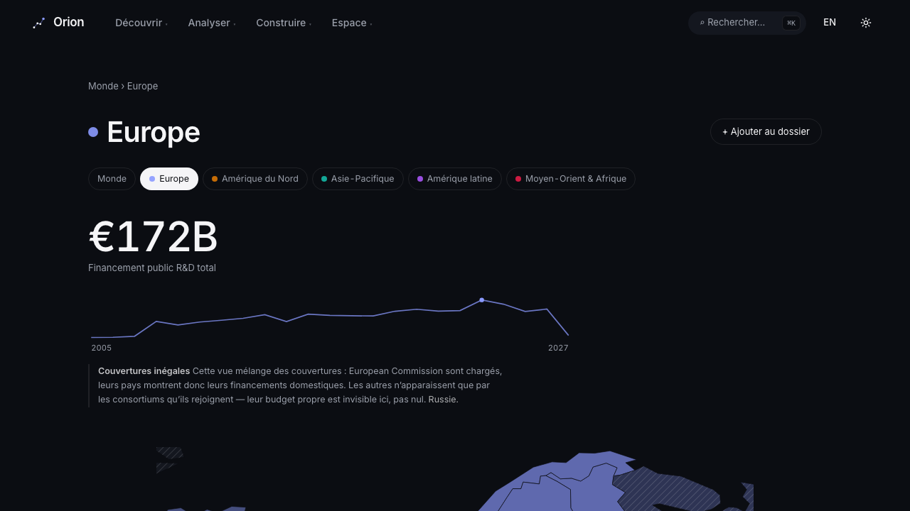

Exemple constaté : Europe. Fil d'Ariane « Monde › Europe », **+ Ajouter
au dossier**, onglets de région, total (« €172B »), **note de
couverture inégale** (« les pays de la Commission européenne montrent
leur financement domestique ; les autres n'apparaissent qu'à travers
les consortiums qu'ils rejoignent — leurs budgets propres sont
invisibles ici, pas nuls ») ; carte régionale ; **PAYS, CLASSÉS** (54
en Europe, badge « PARTIEL » pour les pays vus seulement par
participation : Russie, Bélarus, Monaco…) ; **FINANCEMENTS PAR ANNÉE ·
M€** (barres verticales 2005–2027) ; **TOP ORGANISATIONS** ; **EN
BREF** (pays, projets) ; « EXPLORER D'ICI ».

### 1.15 Fiche pays — `/explore/countries/:code`

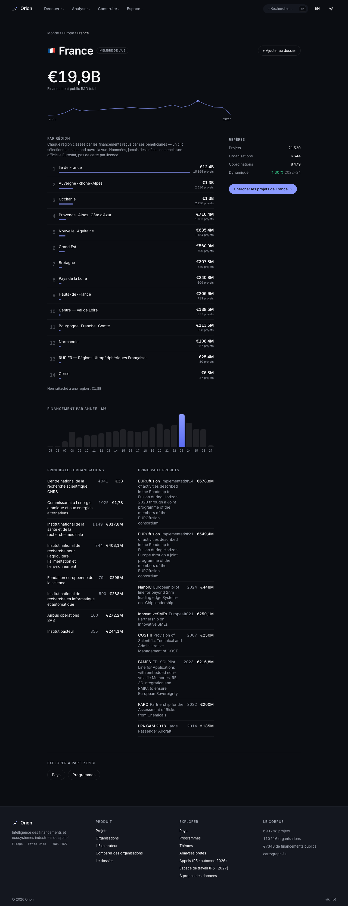

Exemple constaté : France. Fil d'Ariane « Monde › Europe › France »,
drapeau, badge « MEMBRE DE L'UE », **+ Ajouter au dossier**, total
(« €19,9B ») avec sparkline. Sections :

- **PAR RÉGION** : les subdivisions officielles classées (Île-de-France
  €12,4B · 15 395 projets, …, Corse), avec la règle affichée :
  « Nommées, pas dessinées : nomenclature officielle Eurostat, pas de
  carte par licence » et le reliquat « Non rattaché à une région :
  €1,8B » ;
- **FINANCEMENTS PAR ANNÉE · M€** (barres verticales) ;
- **TOP ORGANISATIONS** (avec compte de projets et montant) ;
- **TOP PROJETS** (année, montant) ;
- **EN BREF** : projets, organisations, coordinations, momentum ;
- « Chercher les projets de France → » et « EXPLORER D'ICI ».

### 1.16 Programmes — `/explore/programmes` et fiche `/:id`

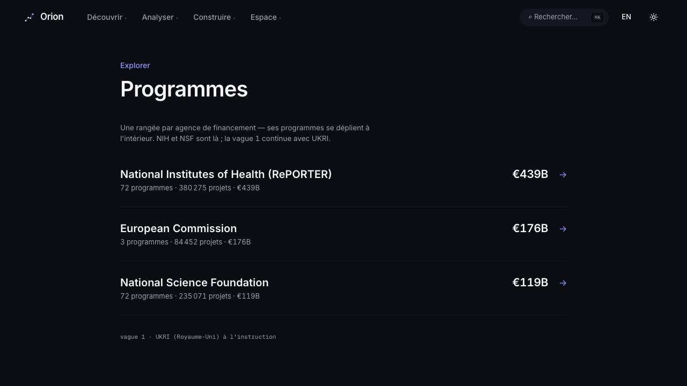
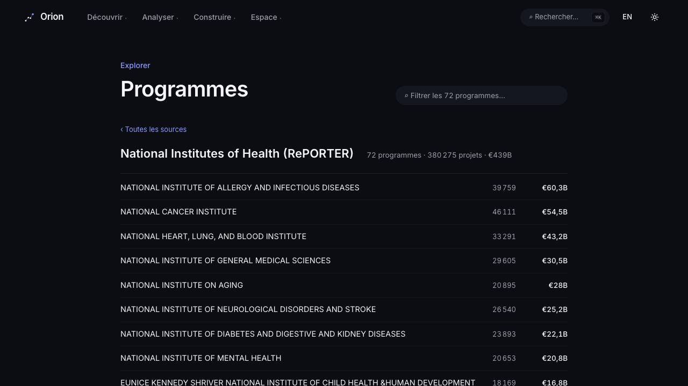
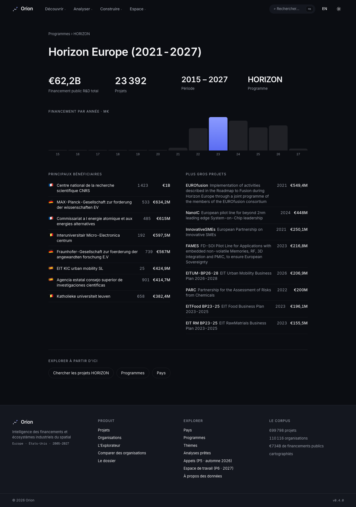

Racine : « Une rangée par agence de financement — ses programmes se
déplient à l'intérieur. NIH et NSF sont là ; la vague 1 continue avec
UKRI. » Trois agences : **NIH RePORTER** (72 programmes · 380 275
projets · €439B), **Commission européenne** (3 · 84 452 · €176B),
**NSF** (72 · 235 071 · €119B). Une agence se déplie sur place
(`?funder=nih|ec|nsf`) avec « ‹ Toutes les sources » et, au-delà d'une
poignée de programmes, un filtre vivant (« ⌕ Filtrer les 72
programmes… »). Mention basse : « vague 1 · UKRI (UK) en instruction ».

La **fiche programme** (p. ex. Horizon Europe) : grandeurs de tête
(total, projets, période, code), **FINANCEMENTS PAR ANNÉE · M€**
(barres verticales), **TOP BÉNÉFICIAIRES** (drapeau, nom → fiche,
projets, montant), **PLUS GROS PROJETS** (année, montant → fiche),
« EXPLORER D'ICI ». Pas de bouton dossier sur cette fiche.

### 1.17 Thèmes — `/explore/themes`

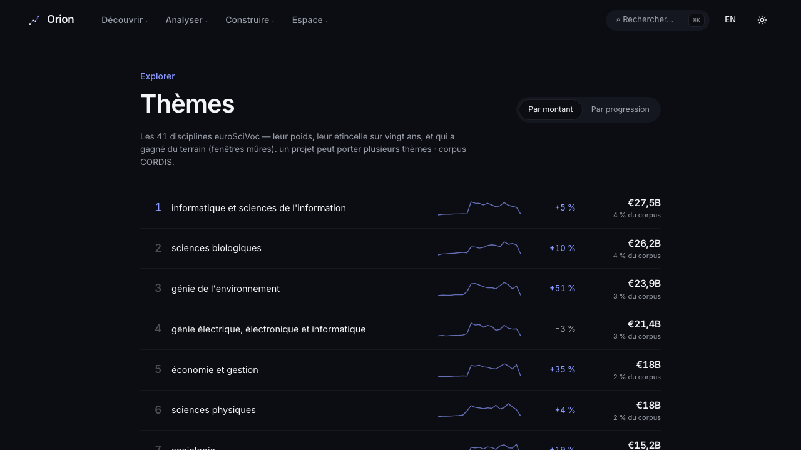

« Les 41 disciplines euroSciVoc — leur poids, leur étincelle sur vingt
ans, et qui a gagné du terrain (fenêtres mûres). Un projet peut porter
plusieurs thèmes · corpus CORDIS. » Deux tris : **Par financements /
Par momentum**. Chaque rangée : rang, nom, sparkline vingt ans,
momentum signé (« +51 % », « −36 % »), montant, part du corpus. Une
rangée ouvre la tendance du thème dans l'Explorateur (courbes
comparées).

### 1.18 À propos des données — `/about-data`

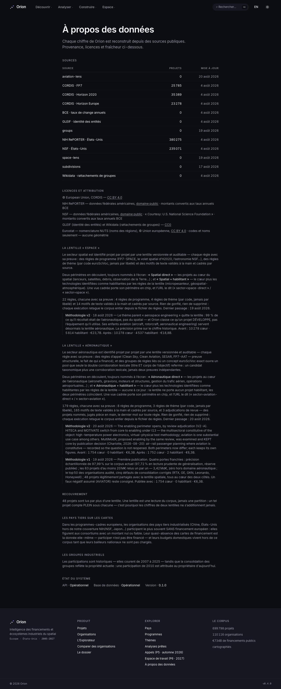

« Chaque chiffre d'Orion est reconstruit de sources publiques.
Provenance, licences et fraîcheur ci-dessous. » Contenu :

- **SOURCES** : table source / projets / date de mise à jour (CORDIS
  FP7, H2020, Horizon Europe ; NIH RePORTER ; NSF ; BCE taux de
  change ; GLEIF ; Wikidata ; groups ; subdivisions ; space-lens ;
  aviation-lens) ;
- **LICENCES ET ATTRIBUTION** : CORDIS CC BY 4.0 ; NIH/NSF domaine
  public (montants convertis aux taux annuels BCE) ; GLEIF et Wikidata
  CC0 ; Eurostat NUTS CC BY 4.0 (« codes et noms seulement — aucune
  géométrie ») ;
- **LA LENTILLE SPATIALE** : 22 règles versionnées et auditables, deux
  périmètres nommés à l'écran et dans l'URL ; journal de méthodologie
  (v2, 18 août 2026 : « aerospace engineering » quitte la lentille —
  avant/après chiffré) ;
- **LA LENTILLE AVIATION** : 179 règles (dont 3 adjudications de revue
  nommées), deux périmètres ; journal v1 (première publication, quatre
  portes de qualité chiffrées) et v2 (20 août 2026 : le périmètre
  habilitant s'ouvre — HITECA et MOTIVATE passent en habilitant,
  MultiModX maintenu cœur par décision de publication, « consignée pour
  que la question ne se rouvre pas ») ;
- **CHEVAUCHEMENT** : 48 projets lus par plus d'une lentille — « les
  chiffres de deux lentilles ne s'additionnent jamais » ;
- **PAYS TIERS SUR LES CARTES** : la quasi-absence des pays tiers
  industrialisés est la donnée elle-même (participation ≠ financement) ;
- **GROUPES INDUSTRIELS** : participations historiques, consolidation à
  l'actionnariat d'aujourd'hui ;
- **ÉTAT DU SYSTÈME** : « API · Opérationnelle », « Base de données ·
  Opérationnelle », « Version · 0.1.0 » (numéro d'API, distinct du
  v0.4.0 du footer).

### 1.19 La page 404

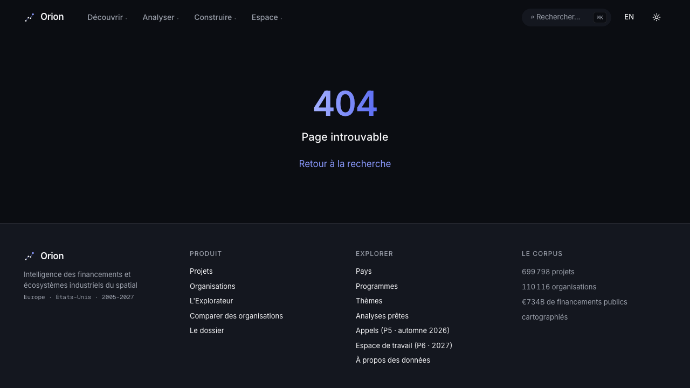

« 404 — Page introuvable — Retour à la recherche » (lien vers
`/projects`).

---

## 2. La navigation

### 2.1 Le header

Constante sur toutes les pages (sauf la Lens Room) : logo **Orion**
(retour à l'accueil, lentille conservée), le **chip de périmètre**
(§ 2.2), **quatre menus** déroulants, la recherche (**⌕ Rechercher…
⌘K**), le **chip Dossier** (§ 2.5), la bascule de langue (**FR/EN**) et
la bascule de thème (icône soleil/lune). Un lien d'évitement « Aller au
contenu » s'affiche au premier Tab.

Contenu exact des menus (libellés FR — EN entre parenthèses ; chaque
entrée porte une ligne de description ; Échap ferme sans naviguer ;
chaque panneau se termine par la rangée « ▤ Dossier · n ») :

**Découvrir (Discover)** :
1. Projets — « tous les projets financés, recherche bilingue » ;
2. Organisations — « fiches consolidées, poste de veille inclus » ;
3. Pays & monde — « le globe, la carte, une fiche par pays » ;
4. Programmes — « les programmes-cadres et les instituts financeurs » ;
5. Thèmes ✧ — « 41 disciplines — qui monte, qui descend » ;
6. Appels, badge `P5 · automne 2026` — « catalogue et correspondance » ;
7. À propos des données — « sources, licences, fraîcheur ».

**Analyser (Analyse)** :
1. Analyses prêtes ✧ — « une question, plusieurs angles — cliquez, puis
   modifiez » ;
2. Explorateur — « composez : métrique × dimension × comparaison » ;
3. Comparer — « jusqu'à quatre organisations côte à côte » ;
4. Tendances par thème — « la course des disciplines dans le temps »
   (`/explore?by=theme&split=1`).

**Construire (Build)** :
1. Le dossier — « collectionnez des vues, assemblez, emportez » ;
2. Rapports partagés, badge `P6 · 2027` — « vues d'équipe, digests » —
   entrée **inerte** (grisée, sans lien).

**Espace (Workspace)** :
1. Espace de travail, badge `P6 · 2027` — « suivis, recherches
   sauvegardées, alertes » ;
2. Alertes, badge `P5–P6` — « un concurrent gagne un projet sur votre
   thème » — entrée **inerte** ;
3. mention « Déjà aujourd'hui : chaque vue est une URL — partagez-la ».

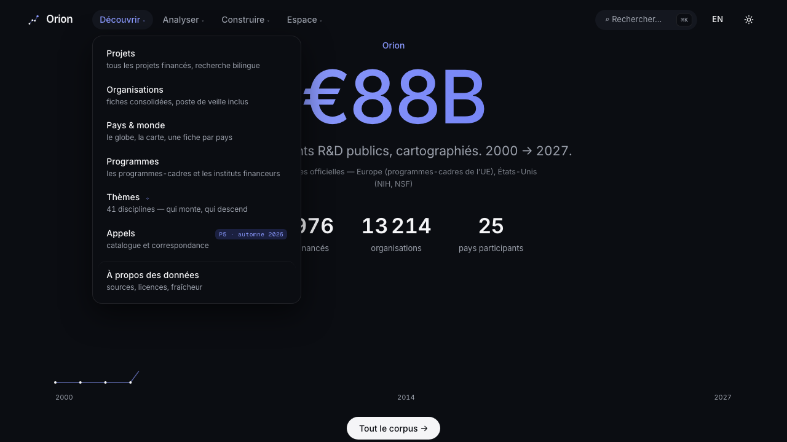

### 2.2 Le chip de périmètre et ses états

Sans lentille, il n'y a pas de chip : le header dit « Orion » seul.
Sous lentille, la marque devient « Orion **/ SPACE** » (FR :
« / ESPACE », « / AÉRONAUTIQUE ») ; le chip lie vers `/lenses`. C'est
la bascule ORION/LENTILLE du header : « Orion » garde la lentille et
ramène à l'accueil cadré ; le chip ramène à la Lens Room pour changer
de verre.

Sur les **vues cadrées** (Explorateur, pages de recherche), un second
chip — le chip de périmètre de la vue — s'affiche dans la zone de
composition (« Espace + habilitant ▾ ») et déroule les cinq états
possibles plus une sortie :

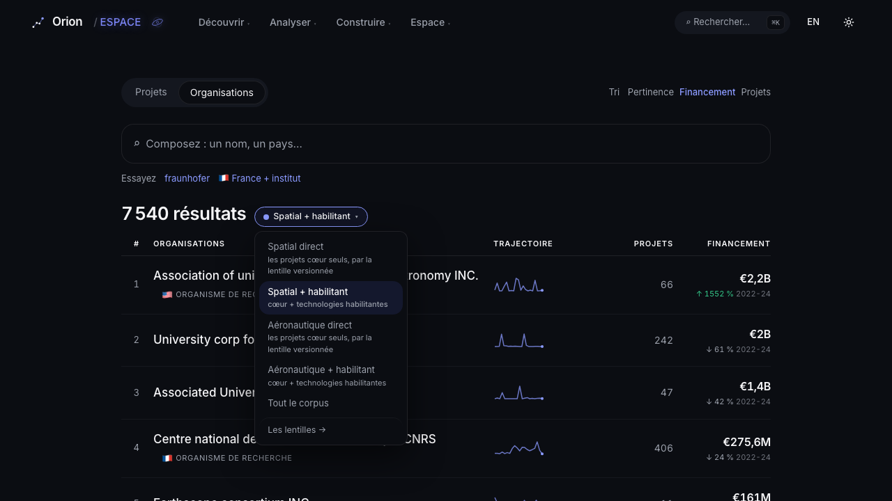

- Spatial direct (« Space direct ») — « les projets cœur seuls, par la
  lentille versionnée » ;
- Spatial + habilitant (« Space + enabling ») — « cœur + technologies
  habilitantes » ;
- Aéronautique direct ; Aéronautique + habilitant (actif depuis la
  méthodologie v2 du 20 août 2026) ;
- Tout le corpus ;
- « Les lentilles → » (`/lenses`).

### 2.3 Comment la lentille voyage (`withLens`, `?sector=`)

La lentille active est **portée par l'URL seule** : `?sector=<slug>`
(cœur + habilitant) ou `?sector=<slug>-direct` (cœur seul) ; zéro ou
une lentille par vue, jamais deux. En naviguant, les liens du produit
recopient le paramètre — menus, portes, fils d'Ariane, liens croisés
des fiches. Trois surfaces font exception et ne portent jamais la
lentille : **Appels**, **Comparer**, **le dossier** (le menu les lie
sans `?sector=`).

Deux familles de surfaces se distinguent sous lentille :

- les surfaces **recadrées** — leurs chiffres changent : accueil,
  recherche projets/organisations, Explorateur, analyses ; le titre de
  l'onglet le dit (« ORION / SPACE · Organisations ») ;
- les surfaces **porteuses** — les fiches (organisation, groupe, pays,
  programme) gardent leurs chiffres corpus entier mais recopient la
  lentille dans leurs liens sortants.

Une URL portant une lentille inconnue (`?sector=inexistante`) affiche
le refus honnête : « Cette lentille n'est pas disponible — Orion ne
peut pas reproduire cette vue avec la lentille indiquée dans le lien.
Voir toute la R&D → ».

Le choix d'entrée (`orion.lens.entry`) ne sert qu'à une chose : router
le premier `/` (vers `/lenses` si aucun choix, sinon vers l'accueil du
dernier verre choisi).

### 2.4 Les liens croisés entre fiches

Toutes les fiches sortent vers les fiches voisines : projet →
organisations participantes, programme, pays du consortium ;
organisation → partenaires, projets du portefeuille, comparateur,
tendance de thème ; groupe → entités, partenaires, comparateur ; pays →
organisations, projets, recherche filtrée ; région → pays ; programme →
bénéficiaires, projets. Chaque page se clôt par le bloc « EXPLORER
D'ICI » (sorties contextuelles). Les actualités de l'accueil mènent aux
fiches et vues qu'elles racontent.

### 2.5 Le fil du dossier

Le dossier est présent partout où l'on navigue : chip « ▤ Dossier · n »
dans le header (dès qu'il n'est pas vide) et rangée « ▤ Dossier · n »
en bas de chaque menu ; porte Construire de l'accueil (avec le compte de
vues) ; boutons « + Ajouter au dossier » sur les surfaces collectables
(§ 5) qui basculent en « ✓ Au dossier · retirer » ; et, depuis chaque
vue du dossier, « Ouvrir la vue vivante ↗ » qui rouvre l'état Explorer
d'origine.

### 2.6 La Lens Room : entrées et sorties

Entrées : premier `/` d'un visiteur sans choix ; « Les lentilles → »
(héros) ; le chip « / SPACE » du header ; « The lenses → » du menu de
périmètre. Sorties : cliquer un verre (vers l'accueil, cadré ou non) ou
le logo « Orion » du header (accueil).

---

## 3. Les visualisations, exhaustivement

Ce qui suit couvre **tout ce qu'Orion sait dessiner**. Sauf mention,
tout est rendu en SVG ou en DOM (pas de bitmap), thème sombre et clair.

### 3.1 L'Explorateur, vues agrégées (`split=0`)

Où : `/explore`. Trois formes, basculables sous la carte (l'URL retient
la forme via `view=`) :

- **Donut** (`view` par défaut) — anneau avec total au centre (« €3,8B ·
  total de la vue »), légende à droite : pastille de couleur, entrée,
  montant, part ; tranche « autres » grise et sa part. Survol : la
  tranche s'accentue.
  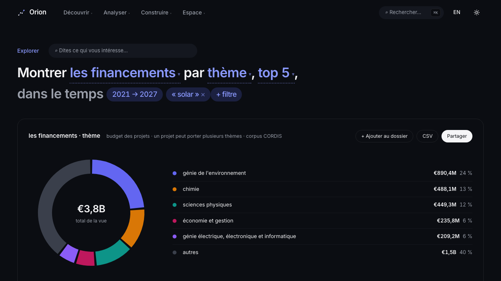
- **Barres** (`view=bars`) — barres **horizontales** à bouts arrondis
  sur piste sombre : libellé à gauche, barre proportionnelle, montant à
  droite.
  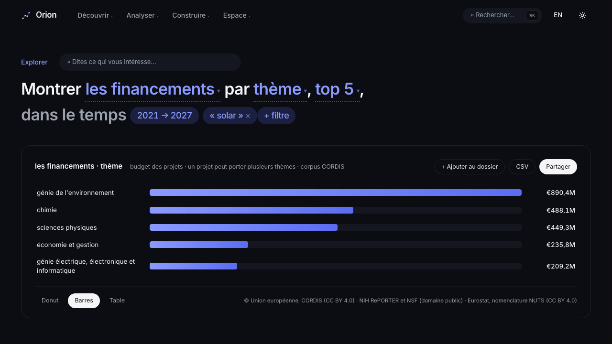
- **Table** (`view=table`) — deux colonnes ENTRÉE / VALEUR.

En-tête de carte : le titre composé (« les financements · thème »), la
**note de lecture** (« budget des projets · un projet peut porter
plusieurs thèmes · corpus CORDIS », ou « part des participants » selon
la dimension), et les trois actions : **+ Ajouter au dossier**, **CSV**,
**Partager**. Bas de carte : la ligne de crédit des sources.

### 3.2 L'Explorateur, vues temporelles (`split=1`, « dans le temps »)

Quatre formes :

- **Courbes** (« Lines », défaut) — multilignes, une couleur par série,
  étiquettes directes au bord droit, axe € à gauche, années en bas.
  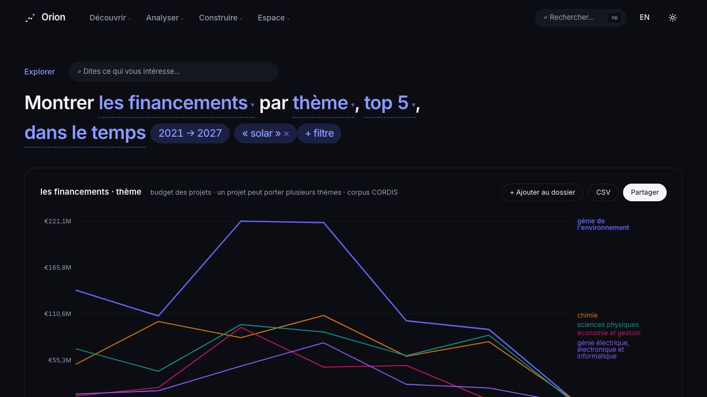
- **Rangs** (« Ranks », `view=bump`) — bump chart : le rang (no 1 en
  haut) de chaque série année par année, étiquettes aux deux bords.
  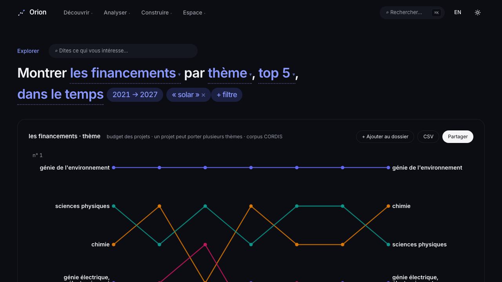
- **Avant / après** (`view=delta`) — dumbbell : pour chaque entrée, un
  point creux (première fenêtre, p. ex. 2021–2022), un point plein
  (seconde, 2023–2024), un trait qui les relie, le pourcentage signé à
  droite.
  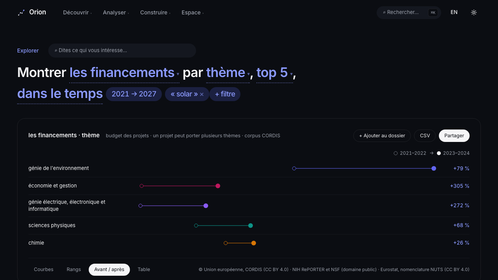
- **Table**.

### 3.3 L'Explorateur, mode angles (`?angles=<slug>`)

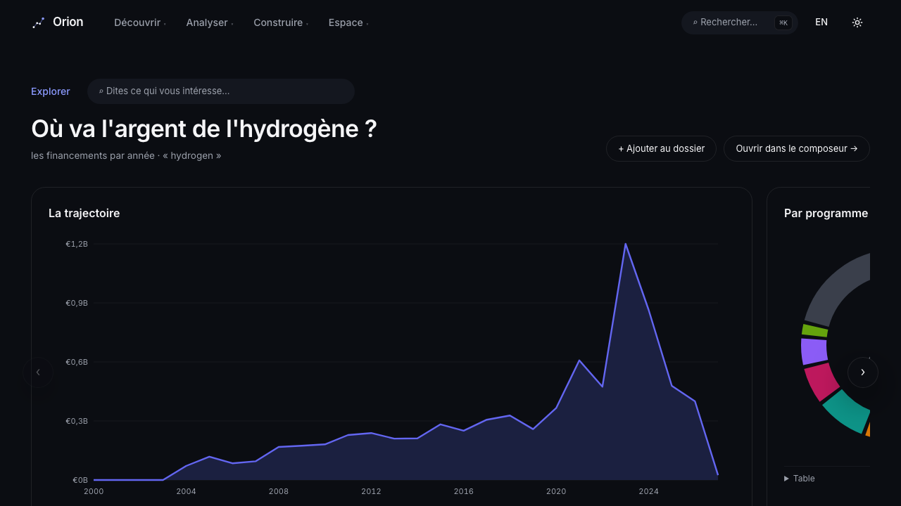

L'habillage des analyses prêtes : le titre-question (« Où va l'argent
de l'hydrogène ? »), puis un **deck glissable** (‹ ›) d'angles nommés —
p. ex. « La trajectoire » (aire/ligne par année), « Par programme »
(donut), « Par pays, sur la carte », « Qui est financé », « La course
des pays (rangs) ». Chaque angle porte **+ Ajouter au dossier**, sa
bascule Table, et « Ouvrir dans le composeur → » qui déplie l'état
Explorer correspondant.

### 3.4 Le comparateur

- **Trajectoires** — multilignes (une par entité comparée), étiquettes
  directes ; bascule Table.
- **Écart annuel** — barres divergentes par année (« X moins Y »).
- **Par programme / Par thème / Par pays** — les mêmes formes agrégées
  que l'Explorateur, par entité.
- **TOTAUX, COMPARÉS** — grands nombres côte à côte.

### 3.5 Compteurs, sparklines et deltas (partout)

- **Compteurs animés** (héros, grandeurs de fiches) : montent vers leur
  valeur ; sur l'accueil ils sont pilotés par le défilement.
- **Sparklines** : frise du héros (« Funding per year », avec marqueur
  de valeur), trajectoire dans l'en-tête des fiches organisation /
  pays / groupe, colonne TRAJECTOIRE des classements (72 × 22 px),
  étincelle vingt ans de chaque thème.
- **Badges de momentum** (« ↑ 52 % 2022-24 », « ↓ 30 % », « — ») :
  classements, EN BREF des fiches, signaux de veille.
- **FINANCEMENTS PAR ANNÉE · M€** : barres **verticales** par année
  (fiches région, pays, programme) ; sur la fiche organisation, la même
  forme empile deux séries (coordonné / participé).

### 3.6 Le globe

Où : accueil et `/explore/countries` (vue Globe). Globe 3D en SVG,
rotation à la molette/au glisser (« glisser pour tourner »), rotation
d'ambiance stoppée sous reduced-motion. Chaque pays financé est teinté
par sa région (Europe, Amérique du Nord, Asie-Pacifique, Amérique
latine, Moyen-Orient & Afrique) ; **hachures** = « financements
domestiques non couverts » (le pays n'apparaît que par participation) ;
gris = « pas encore de donnée ». Points = capitales/villes. **Survol
d'un pays couvert** : infobulle « Italy · €14,4B — 5 premières
collaborations » et les cinq partenaires s'affichent en pastilles
(GB, NL, DE, FR, ES) posées sur le globe. **Clic** : ouvre la fiche
pays (accueil) ou le panneau pays (Explore).

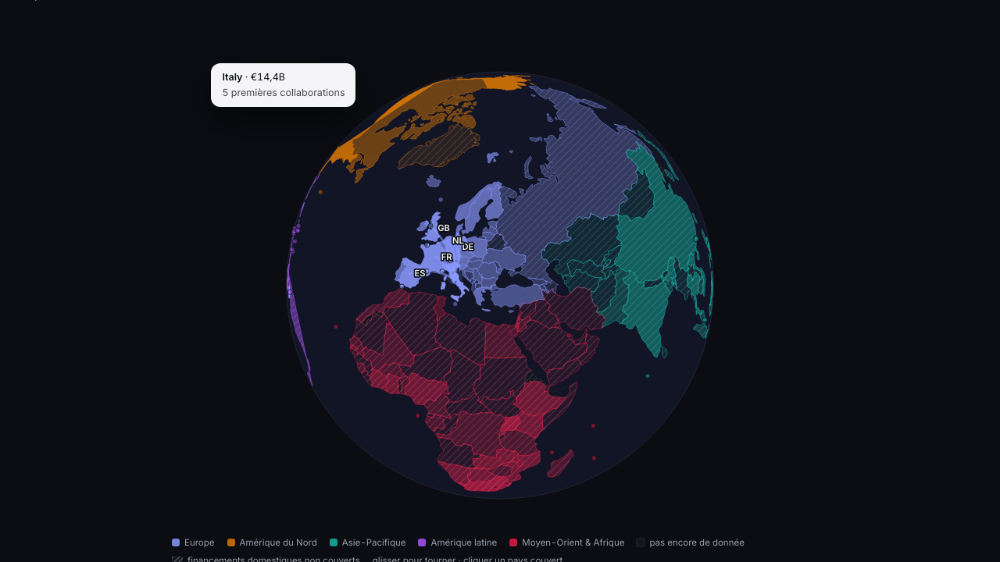

### 3.7 La carte plate et le panneau pays

Où : `/explore/countries` (vue Carte), fiches région, fiche
organisation (« Où vivent ses partenaires »), fiche groupe (« Où vit le
groupe »). Carte du monde SVG teintée par une **échelle de
financement** (« <10 M€ → >10 Md€ ») ou par région selon la surface ;
mêmes hachures ; survol = collaborations. « Premier clic : le pays se
sélectionne · un second ouvre sa fiche. »

Le **panneau pays** (premier clic, sur l'accueil-Explore et les
régions) : drapeau, nom, phrase de rang (« 3ᵉ pays financé du monde —
dans les données Orion — €19,9B répartis sur 21 520 projets depuis
2005 »), trois grandeurs (financements, projets, pays partenaires),
« CE QUE CE PAYS FINANCE » (thèmes et montants), « AVEC QUI »
(drapeaux), « Ouvrir la fiche <pays> → », photo d'illustration créditée
(« Photo : Diliff · Domaine public »), fermeture ✕.

### 3.8 Les tables

- classement des organisations (§ 1.5) et ses variantes de recherche ;
- classements de pays (208 au monde, par région) ;
- PORTEFEUILLE paginé des fiches organisation ;
- PARTICIPANTS des fiches projet ;
- table de synthèse et partenaires communs du comparateur ;
- vues « Table » de l'Explorateur, des angles et du dossier ;
- SOURCES de la page À propos.

### 3.9 Les habillages non chiffrés

Constellations décoratives (Lens Room, cartes d'actualités
officielles), glyphes des verres, ornement du logo. Le carrousel
d'actualités (§ 1.2) est la seule surface auto-animée de la page ;
flèches ‹ ›, points de position, avance automatique.

### 3.10 Ce qui n'existe pas à l'écran

Pour lever le doute d'un lecteur extérieur : pas de treemap, pas de
graphe-réseau, pas de nuage de points, pas de carte de chaleur, pas de
barres empilées 100 %. Les cartes n'ont **aucune géométrie
infranationale** (les régions d'un pays sont « nommées, pas
dessinées » — licence Eurostat).

---

## 4. Les données affichées

**Les grandeurs.** Partout les mêmes familles, toujours étiquetées à
l'écran :

- **financements** en euros, abrégés (€448M, €19,9B, « M€ » sur les
  axes) ; les montants des sources américaines sont **convertis aux
  taux annuels BCE** (dit sur la page À propos) ;
- **comptes** : projets, organisations, pays, groupes, entités,
  programmes, « n projets partagés », « n résultats » ;
- **périodes** : années de démarrage (2005–2027 pour le corpus ; le
  héros de l'accueil annonce 2000 → 2027), durées de projet
  (2024 – 2028), fenêtres de momentum (« 2022-24 vs 2019-21 ») ;
- **parts** : % de part (donut, rôles, entités d'un groupe), % signés
  de momentum, « part de coordination » (métrique de l'Explorateur) ;
- **métriques composables** (Explorateur) : les financements, les
  projets, les organisations actives, le financement moyen par projet,
  la part de coordination.

**« Chaque chiffre a sa source », tel que l'écran le manifeste :**

- chaque carte de l'Explorateur porte sa **note de lecture** (« budget
  des projets · un projet peut porter plusieurs thèmes · corpus
  CORDIS ») et sa **ligne de crédit** (« © Union européenne, CORDIS
  (CC BY 4.0) · NIH RePORTER et NSF (domaine public) · Eurostat,
  nomenclature NUTS (CC BY 4.0) ») ;
- chaque fiche projet cite sa source, son identifiant externe cliquable
  et sa licence ;
- chaque vue du dossier consigne sa **date des données** (« données au
  2026-08-21 ») et ses sources ;
- la couverture est dite sur les cartes (« Couverture : Europe — CORDIS
  … · États-Unis — NIH, NSF »), les absences aussi (« pas encore de
  donnée », « financements domestiques non couverts », badge
  « PARTIEL », note de couverture inégale des régions) ;
- les rattachements de groupe affichent **provenance et confiance**
  (« curation, 95 % », « gleif, 75 % ») et les coentreprises leur
  pondération ;
- les seuils d'affichage sont énoncés (« sous les planchers
  d'honnêteté, rien ne s'affiche du tout ») ;
- la page À propos date chaque source et journalise les méthodologies
  de lentilles, avant/après chiffrés.

---

## 5. Le dossier

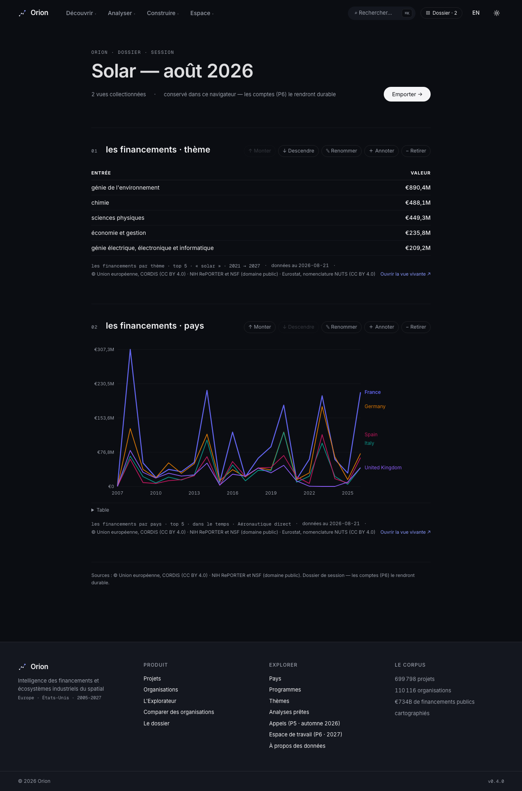

**Ce qu'on y ajoute, et d'où.** Le bouton « + Ajouter au dossier »
existe sur :

- toute vue de l'**Explorateur** (agrégée, temporelle, chaque angle
  d'une analyse) — lentille et périmètre compris ;
- les vues composées du **comparateur** ;
- les fiches **organisation**, **groupe** et **région**, et la fiche
  **pays** — ajouter une fiche range en réalité **la vue Explorer
  canonique de l'entité** (constaté : ajouter Johns Hopkins stocke
  l'état `by=organisation&split=1&compare=12267`, titré du nom de
  l'organisation).

**Ce qu'on ne peut pas y ajouter** : une fiche projet, une fiche
programme, une page de recherche et ses résultats, la page thèmes, une
actualité.

**Ce que contient une vue collectée** : l'état Explorer complet
(métrique, dimension, période, texte cherché, forme, périmètre de
lentille), un titre, une note éventuelle, la date d'ajout.

**Comment on le consulte.** `/dossier` (chip du header, menus, porte
Construire). Bandeau : « n vues collectionnées · conservé dans ce
navigateur — les comptes (P6) le rendront durable ». Un champ de titre
(suggestion datée en filigrane, p. ex. « Solar — August 2026 »). Chaque
vue, numérotée, est **rendue vivante** (le graphique ou la table, aux
données du jour) avec sa légende composée (« les financements par pays ·
top 5 · dans le temps · Aéronautique direct »), sa date de données, ses
sources, et « Ouvrir la vue vivante ↗ ». Par vue : **↑ Monter,
↓ Descendre, ✎ Renommer** (édition en place), **＋ Annoter** (« Votre
note en marge… »), **− Retirer**.

**Comment on l'emporte.** « Emporter → » appelle l'impression du
navigateur (mise en page dédiée : les commandes disparaissent à
l'impression) — c'est la voie du PDF. Il n'y a **pas** de bouton de
partage du dossier entier : ce qui se partage, c'est chaque vue (son
URL, via « Partager » dans l'Explorateur).

**Comment on le vide.** En retirant les vues une à une (« − Retirer »
sur chaque vue, ou « ✓ Au dossier · retirer » depuis la surface
d'origine). Pas de bouton « tout vider ».

**Persistance et limites.** localStorage du navigateur, clé
`orion.dossier.v1` — pas de compte : le dossier ne suit ni l'appareil
ni le navigateur voisin, et l'écran le dit (« les comptes (P6) le
rendront durable »). Les titres de vues sont figés dans la langue
active au moment de l'ajout ; le rendu, lui, est vivant (données du
jour). Le chip « Dossier · n » n'apparaît qu'à partir de la première
vue.

---

## 6. Les capacités annoncées non actives

Reprise de l'inventaire du lot 0
([inventaire-capacites.md](inventaire-capacites.md), 2026-08-20),
actualisée au 21 août — pour qu'un lecteur extérieur distingue le
construit du promis. Tout ce qui suit est **annoncé à l'écran, daté,
et sans fonction aujourd'hui** :

| Annonce | Badge | Où elle s'affiche | État réel |
|---|---|---|---|
| Appels — catalogue, matching, éligibilité, ponts vers le passé | `P5 · automne 2026` | menu Découvrir, `/calls`, porte Suivre, footer | vitrine ; rien de fonctionnel |
| Espace de travail — suivis, recherches sauvegardées, alertes, partage d'équipe | `P6 · 2027` | menu Espace, `/workspace`, footer | vitrine ; aucun compte n'existe |
| Rapports partagés — vues d'équipe, digests | `P6 · 2027` | menu Construire | entrée de menu inerte (grisée) |
| Alertes — « un concurrent gagne un projet sur votre thème » | `P5–P6` | menu Espace ; évoquées par `/calls` et `/workspace` | entrée de menu inerte |
| Durabilité du dossier | mention `P6` | bandeau et pied du dossier | le dossier vit, en localStorage seulement |
| Porte « Suivre » de l'accueil | `P5–P6 · 2026–2027` | accueil, quatrième porte | rangée non cliquable |
| Vague 1 des sources — UKRI | *(sans badge)* | `/explore/programmes` (« la vague 1 continue avec UKRI », « UKRI (UK) en instruction »), couverture du globe (« Ensuite : UKRI, SNSF, NWO, Vinnova ») | annonce ; NIH et NSF, eux, sont livrés |

Depuis le lot 0, une annonce est **sortie** de cette liste : le
périmètre « Aviation + habilitant », alors « prêt mais débranché », est
actif aujourd'hui (méthodologie v2 du 20 août 2026, journalisée sur la
page À propos ; le chip de périmètre l'offre et il fonctionne).

Les vitrines `/calls` et `/workspace` obéissent au même contrat
d'honnêteté, affiché : promesse datée, features décrites, ponts vers ce
qui existe déjà, et clôture explicite (« Pas de formulaire, pas de
liste d'attente — la date suffit », « Cette page dit la date, et
s'arrête là »).

---

## 7. La recherche et les filtres

### 7.1 La recherche globale (⌘K)

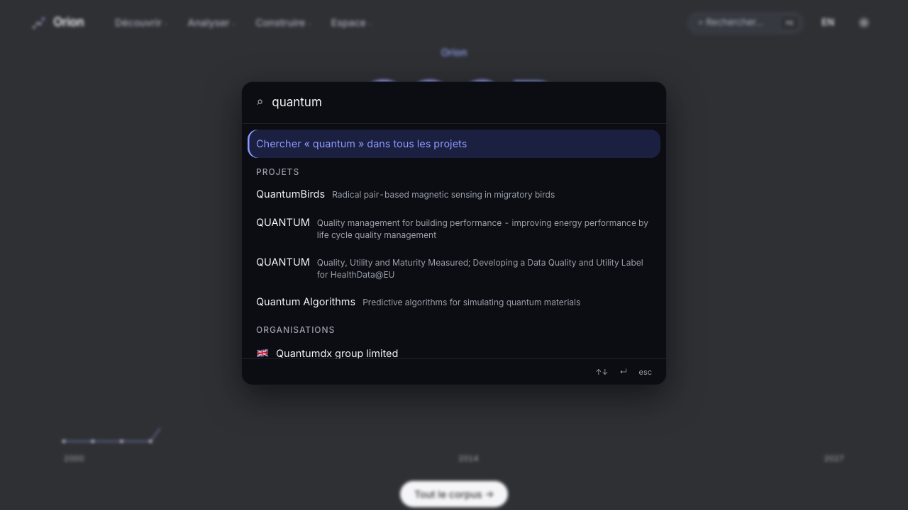

Depuis toute page : bouton du header ou ⌘K. Boîte modale avec cinq
puces d'amorce (Hydrogène, Intelligence artificielle, Batteries,
Quantique, Capture de carbone) et rappel clavier (↑↓ ↵ esc). En
tapant : « Chercher “…” dans tous les projets » (→ `/projects?q=…`),
puis des suggestions **PROJETS** (nom + sous-titre) et **ORGANISATIONS**
(drapeau + nom) — dix suggestions, navigables au clavier, qui ouvrent
directement les fiches.

### 7.2 La recherche composable (accueil)

Le champ du héros (« Que cherchez-vous ? ») propose les mêmes
suggestions de fiches, plus des **destinations composées** — constaté
par les trois puces d'exemple :

- « le solaire par thème depuis 2021 » →
  `/explore?time=2021..2027&by=theme&split=0&q=solar` (dimension +
  période + texte lus dans la phrase) ;
- « qui coordonne les satellites ? » →
  `/explore?metric=coordination&q=satellites` (la métrique lue dans la
  question) ;
- « CNRS vs Fraunhofer » → `/compare?orgs=…~…` (le « vs » lu comme une
  comparaison ; les deux noms résolus en organisations).

L'Explorateur porte le même champ (« Dites ce qui vous intéresse… »).

### 7.3 La recherche de projets et d'organisations

Voir § 1.3 et § 1.5 : critères en puces retirables, panneau AFFINER
(financeurs, programmes, pays — chaque facette cliquable avec son
compte), tris, groupes en tête, « cherché en anglais et en français »
(la recherche est bilingue : un texte français trouve les projets
anglais, et inversement).

### 7.4 Les filtres de l'Explorateur

La phrase composable : « Montrer **[métrique]** par **[dimension]**,
**[top 5|top 10|top 25|entrées choisies]**, **dans le temps** » + puce
de période (deux années, 2005–2027), puce « q » retirable, « + filtre »
(thème — cherché en anglais et français —, pays), chip de périmètre
sous lentille. Choisir des entrées précises dans le troisième
emplacement bascule la vue en **comparaison** de ces entrées.

### 7.5 Ce que l'URL encode

Chaque vue est une URL — c'est un principe affiché (« chaque vue
composée est une URL partageable ») et le bouton « Partager » copie le
lien (« Lien copié ✓ »). Paramètres constatés :

| Contexte | Paramètres |
|---|---|
| Explorateur | `metric` (défaut : financements), `by`, `split` (0/1), `time=aaaa..aaaa`, `q`, `view` (`bars`/`table`/`bump`/`delta`), `compare` (entrées choisies), `angles` (mode analyse), `sector` (lentille/périmètre) |
| Recherche | `q`, `country`, `year_from`, `funder`… (les facettes actives) |
| Comparateur | `orgs=id~id~…` (séparateur `~`) |
| Programmes | `funder=nih|ec|nsf` (agence dépliée) |
| Partout | `sector=space|space-direct|aviation|aviation-direct` |

Trois choix d'interface ne sont **pas** dans l'URL (localStorage) : la
langue (`orion.lang`), le thème (`orion.theme`), la bascule Globe/Carte
(`orion.geoview`) — et le choix d'entrée de lentille
(`orion.lens.entry`).

Le CSV de l'Explorateur télécharge la vue courante
(`orion-<métrique>-by-<dimension>.csv`).

---

## 8. Les registres transverses

### 8.1 Bilingue FR / EN

Bouton du header (« FR » sur l'interface anglaise, « EN » sur la
française) ; bascule immédiate, retenue en localStorage, `<html lang>`
mis à jour. La traduction couvre l'interface entière : menus, pages,
phrases composables de l'Explorateur, vitrines, dossier, 404 — et les
**noms de thèmes** dans les vues (« génie de l'environnement » /
« environmental engineering »). Restent dans leur langue d'origine :
les données sources (titres et abrégés de projets — étiquetés `EN` —,
noms d'organisations, actualités officielles) et certains noms de pays
dans les composants de carte et de classement (« Germany », « United
States » y restent en anglais sous interface française). La recherche,
elle, est bilingue des deux côtés (§ 7.3).

### 8.2 Thème sombre / thème clair

Bascule du header, retenue en localStorage. Le sombre est le visage par
défaut constaté ; le clair est complet (fond blanc, mêmes accents).

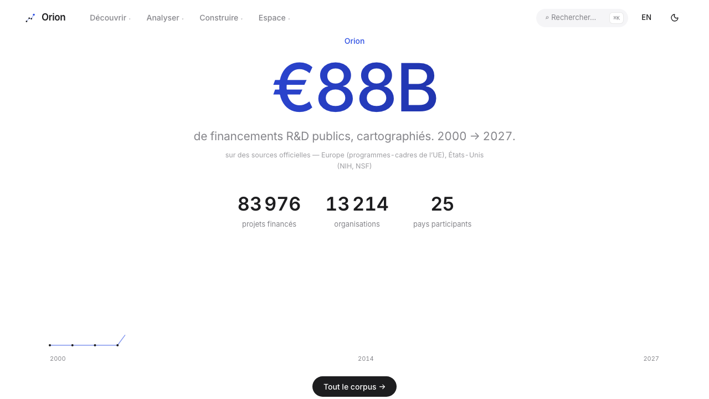

### 8.3 Responsive

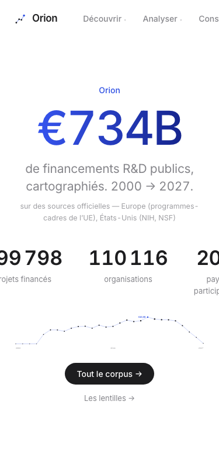

À 375 px de large, les pages se réorganisent (héros empilé, cartes en
colonne, globe réduit). Le header conserve ses quatre menus (pas de
menu burger) ; à cette largeur, le chip de périmètre, le chip Dossier
et le raccourci ⌘K ne sont plus visibles, et la colonne TRAJECTOIRE
des classements disparaît. Le produit est constaté à l'aise en 1440 ×
900 (format du harnais de recette) et utilisable en mobile.

### 8.4 Animations d'ambiance et reduced-motion

Les animations du produit : le héros au défilement (accueil), la
rotation d'ambiance du globe, l'avance automatique du carrousel
d'actualités, les compteurs, les ornements d'arrivée des sections, le
glissement du deck d'angles, les constellations de la Lens Room. Sous
`prefers-reduced-motion`, constaté et vérifié dans les composants : la
rotation du globe s'arrête, le carrousel n'avance plus seul (flèches et
points restent), les compteurs sautent à leur valeur, les ornements
d'arrivée se figent — les contenus restent identiques.

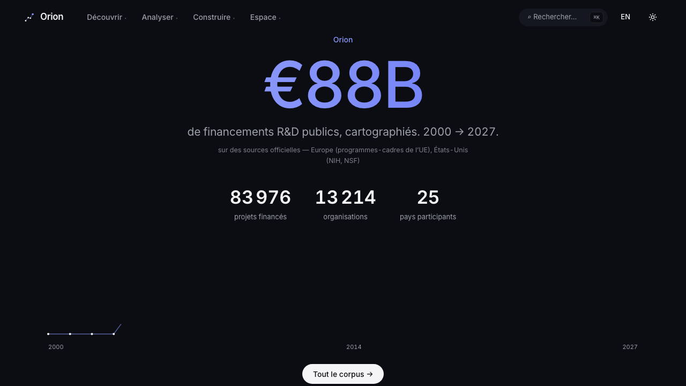

### 8.5 Accessibilité constatée en passant

Lien d'évitement « Aller au contenu » ; rôles ARIA sur les surfaces
(banner, search, dialog modal pour ⌘K, tablist du carrousel, tooltips) ;
navigation clavier de la recherche globale (↑↓ ↵ esc affichés) ; Échap
ferme menus et boîtes ; libellés d'accessibilité sur les graphiques
(« World globe — Orion's coverage, tinted by region », « Funding per
year », « Yearly gap — … »).

---

*Constats réalisés le 21 août 2026 sur `http://localhost:8080`
(pile de production locale, `make up`, v0.4.0), en Chromium via le
harnais Playwright officiel (1440 × 900) et en navigation manuelle.
Aucun code modifié ; les seules pièces ajoutées au dépôt sont ce
document et ses captures.*
